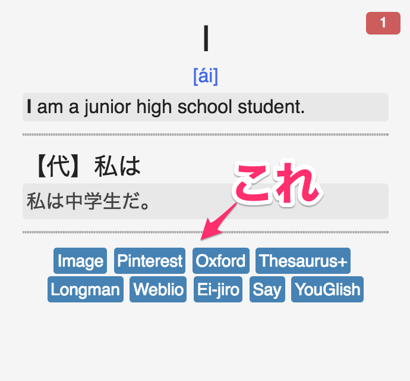

<!-- TOC START min:1 max:3 link:true update:true -->
  - [便利な辞書リスト](#便利な辞書リスト)

<!-- TOC END -->

[Anki](https://apps.ankiweb.net/index.html) について、技術的なTIPSをこの文書に書いていきます。  
[Ankiを始める/紹介する時に必要な情報を集めたページ](https://ei-raku.com/2018/06/learning-anki/) は必読、前提知識とする。  

ちなみに、俺が使っている環境は MacBookPro と iPhone(AnkiMobile) です。Windows は持っていません。  

## 便利な辞書リスト

完全に初見の単語を覚えるのは辛い。何かしら記憶に引っかかりが欲しい。  
そこで有効なのが Google 画像検索や、英英辞典で別の観点での説明を見たりすることだ。  
これをより気楽にやれるようにするために、カードに辞書検索のリンク集を用意しておけば検索が効率的に行える。  
[Ankiで英単語一覧を取り込む「詳細な」説明](https://ei-raku.com/2018/05/learning-anki-import/) に書いてあった辞書を土台に発展させたものが以下。  
カスタマイズして使ってください。  

Ankiで英単語一覧を取り込む「詳細な」説明



- Style

```css
.search {
  display: inline-block;
  font-size: 0.7em;
  color: white;
  background-color: steelblue;
  padding: 0.2em;
  border-radius: 0.2em;
  text-align: center;
}

.search a {
  text-decoration: none;
  color: white !important;
}
```

- Back or Front
```html
<div id="search-group">
  <div class="search"><a href="https://www.google.co.jp/search?q={{eng_word}}&tbm=isch">Image</a></div>
  <div class="search"><a href="https://www.pinterest.jp/search/pins/?q={{eng_word}}">Pinterest</a></div>
  <div class="search"><a href="https://en.oxforddictionaries.com/definition/{{eng_word}}">Oxford</a></div>
  <div class="search"><a href="https://thesaurus.plus/thesaurus/{{eng_word}}">Thesaurus+</a></div>
  <br>
  <div class="search"><a href="https://www.ldoceonline.com/dictionary/{{eng_word}}">Longman</a></div>
  <div class="search"><a href="https://ejje.weblio.jp/content/{{eng_word}}">Weblio</a></div>
  <div class="search"><a href="https://eow.alc.co.jp/search?q={{eng_word}}">Ei-jiro</a></div>
  <div class="search"><a href="https://dopeoplesay.com/q/{{eng_word}}">Say</a></div>
  <div class="search"><a href="https://youglish.com/search/{{eng_word}}">YouGlish</a></div>
</div>
```
