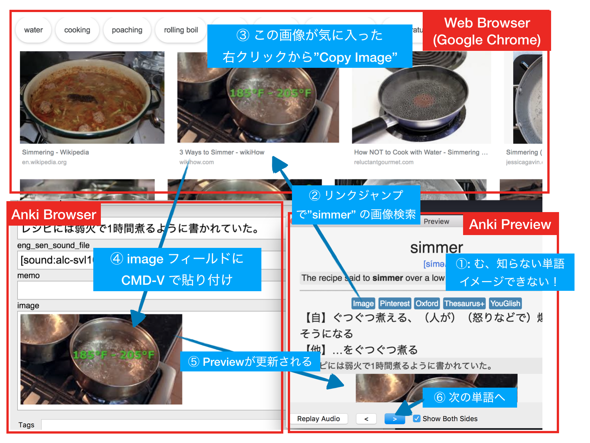

<!-- TOC START min:1 max:3 link:true update:true -->
- [この文書について](#この文書について)
- [TIPS: 便利なリンクのセット](#tips-便利なリンクのセット)
  - [Motivation](#motivation)
  - [Action:Card](#actioncard)
    - [Style](#style)
    - [Front or Back](#front-or-back)
- [TIPS: 音声を登録せずに iPhone に読み上げさせる](#tips-音声を登録せずに-iphone-に読み上げさせる)
  - [Motivation](#motivation-1)
  - [Action:Card](#actioncard-1)
    - [Front](#front)
- [TIPS: TAP をカスタマイズしてより Lazy に操作したい](#tips-tap-をカスタマイズしてより-lazy-に操作したい)
  - [Motivation](#motivation-2)
  - [Action:設定変更](#action設定変更)
- [TIPS:必須では無いフィールドにスタイルを設定した時のゴミを消したい](#tips必須では無いフィールドにスタイルを設定した時のゴミを消したい)
  - [Motivation](#motivation-3)
  - [Action:Card](#actioncard-2)
    - [Style](#style-1)
    - [Front](#front-1)
- [TIPS:フィールドのテキスト内容によってスタイルを変えたい](#tipsフィールドのテキスト内容によってスタイルを変えたい)
  - [Motivation](#motivation-4)
  - [Action:Card](#actioncard-3)
    - [Style](#style-2)
    - [Front](#front-2)
- [TIPS: 覚えにくい単語を覚えやすくする為に画像を追加する](#tips-覚えにくい単語を覚えやすくする為に画像を追加する)
  - [Motivation](#motivation-5)
  - [Action:画像を設定しながら、その作業を通じて単語のイメージを育てる](#action画像を設定しながらその作業を通じて単語のイメージを育てる)

<!-- TOC END -->

# この文書について

- [Anki](https://apps.ankiweb.net/index.html) について、技術的なTIPSをこの文書に書いていきます。  
- [Ankiを始める/紹介する時に必要な情報を集めたページ](https://ei-raku.com/2018/06/learning-anki/) は必読、前提知識とする。  
- 記述のスタイル: TIPS毎に、モチベーション(`Motivation`)を説明し、アクション(`Action`)で解決策を示す。
- 俺の環境: MacBookPro と iPhone(AnkiMobile) です。Windows は持っていません。  

# TIPS: 便利なリンクのセット

## Motivation

完全に初見の単語を覚えるのは辛い。何かしら記憶に引っかかりが欲しい。  
そこで有効なのが Google 画像検索や、英英辞典で別の観点での説明を見たりすることだ。  
これをより気楽にやれるようにするために、カードに辞書検索のリンク集を用意しておけば検索が効率的に行える。  
[Ankiで英単語一覧を取り込む「詳細な」説明](https://ei-raku.com/2018/05/learning-anki-import/) に書いてあった辞書を土台に発展させたものが以下。  


## Action:Card

`{{eng_word}}` は英単語のフィールド名。  
ちなみに僕は省スペースの為に Ei-jiro や Weblio は削除してるし、他のリンクも文字をもっと短縮している。  
各自好きなようにカスタマイズして使ってください。  

### Style

```css
.search {
  display: inline-block;
  font-size: 0.7em;
  color: white;
  background-color: steelblue;
  padding: 0.2em;
  border-radius: 0.2em;
  text-align: center;
}

.search a {
  text-decoration: none;
  color: white !important;
}
```

### Front or Back

```html
<div id="search-group">
  <div class="search"><a href="https://www.google.co.jp/search?q={{eng_word}}&tbm=isch">Image</a></div>
  <div class="search"><a href="https://www.pinterest.jp/search/pins/?q={{eng_word}}">Pinterest</a></div>
  <div class="search"><a href="https://en.oxforddictionaries.com/definition/{{eng_word}}">Oxford</a></div>
  <div class="search"><a href="https://thesaurus.plus/thesaurus/{{eng_word}}">Thesaurus+</a></div>
  <br>
  <div class="search"><a href="https://www.ldoceonline.com/dictionary/{{eng_word}}">Longman</a></div>
  <div class="search"><a href="https://ejje.weblio.jp/content/{{eng_word}}">Weblio</a></div>
  <div class="search"><a href="https://eow.alc.co.jp/search?q={{eng_word}}">Ei-jiro</a></div>
  <div class="search"><a href="https://dopeoplesay.com/q/{{eng_word}}">Say</a></div>
  <div class="search"><a href="https://youglish.com/search/{{eng_word}}">YouGlish</a></div>
</div>
```

# TIPS: 音声を登録せずに iPhone に読み上げさせる

## Motivation

単語や文章の音声を用意するのは結構手間だ。  
ネット経由で TTS(Text To Speech) サービスを利用するのも遅延や通信量が嫌だ。  
音声を登録せず、オフラインで音声読み上げできる？ → できる。iPhone なら。  
Anki のカードは実際には Web ページなので、Web Speech API という新しい Webテクノロジーを使って英文を読み上げさせる事ができる。  

- 参考: [iPhone 版 Anki でテキストを読み上げるには](http://rs.luminousspice.com/speech-text-on-ankimobile/)

## Action:Card

### Front

```html
<div id="eng_word">{{eng_word}}</div>

<script>
  var element = document.getElementById("eng_word");
  window.setTimeout("speak(element.innerText)", 500);
  function speak(word) {
    var speech = new SpeechSynthesisUtterance();
    speech.text = word;
    speech.volume = 0.5; // 音量: 0 to 1 (1)
    speech.rate = 1; // 速度: 0.1 to 9 (2)
    speech.pitch = 1; // ピッチ: 0 to 2, 1=normal (3)
    speech.lang = "en-US"; // 言語: アメリカ英語、日本語なら ja-JP (4)
    speechSynthesis.cancel();
    speechSynthesis.speak(speech);
  }
</script>
```

# TIPS: TAP をカスタマイズしてより Lazy に操作したい

## Motivation

iPhone での操作の不満を改善したい。
デッキをこなしていく時、下に表示されるボタンを正確に押すのが面倒。  
かといって、ボタンサイズを大きくすれば説明の表示エリアが狭くなってしまう。  
AnkiMobile の Taps をカスタマイズすることでよりルーズに操作できる様にしたい。  

[注意]
- **ちなみにこのTIPSと"TIPS: 便利なリンクのセット"を組み合わせる場合、リンク集はなるべく上に配置する方が良い(画像ではそうなっていないが。。。)**
- 理由は誤爆を防ぐため。`Answer Good` をしたくて `Mid Center` をタップしたつもりがリンクへジャンプしちゃうのを避けたい。

<p>


</p>

選択肢3つの場合は直感的に対応している。ただ一つの例外は左下(`Bottom Left`) が 選択肢に現れていない`Answer Hard`になっていること。
iPhone を右手で持ち、片手で操作した場合、`Mid Left` と `Mid Center` が最も押しやすく、ここを基本に直感性、使用頻度を考慮してアクションを対応させていく。

- [俺の手の前提条件]: iPhone を主に右手で操作する。指は比較的短い。
- `Answer Again` と `Answer Good` は位置関係からも直感的に理解しやすく押しやすいエリアにする。
- `Answer Easy` と `Answer Hard` は"意識しないとタップできない"エリアに割り当てた。
- `Bottom Left`は親指が届き難く、意識しないとTap出来ない(普通にTapすると `Mid Left` に届く)。
- `Answer Hard` をどこかに割り当てたかったので、わざわざ意識しないと押せない `Bottom Left` に対応させた。
- オーディオ再生の大きなボタンが嫌で、`Audio Buttons` を非表示に設定しているので、`Audio Replay`が出来ない。
- そこでほとんどのカードで単語が表示される `Top Center`の位置をタップすると `Replay Audio` する様にする。

## Action:設定変更

`Preferences > Review > Taps` を選択してTapの設定をカスタマイズする。  
縦に３つ、横に３つでタップエリアを区別してあり、それぞれにアクションが設定できる。  


| WHEN QUESTION SHOWN  |  -           |
| :---                 | :---         |
| TOP Left             |  Show Answer |
| TOP Center           | Replay Audio |
| TOP Right            |  Show Answer |
| Mid Left             |  Show Answer |
| Mid Center           |  Show Answer |
| Mid Right            |  Show Answer |
| Bottom Left          |  Show Answer |
| Bottom Center        |  Show Answer |
| Bottom Right         |  Show Answer |

| WHEN ANSWER SHOWN  |  -            |
| :---               | :---          |
| TOP Left           |  Mark         |
| TOP Center         | Replay Audio  |
| TOP Right          | Off          |
| Mid Left           | Answer Again |
| Mid Center         | Answer Good  |
| Mid Right          | Answer Easy  |
| Bottom Left        | Answer Hard  |
| Bottom Center      | Answer Good  |
| Bottom Right       | Answer Easy  |

# TIPS:必須では無いフィールドにスタイルを設定した時のゴミを消したい

## Motivation

必須ではないフィールドにスタイルを設定すると、文字が空の時にゴミが残ってダサくなってしまう。  
フィールドが空ではない時は表示しないようにしたい。


## Action:Card

### Style

```css
.card {
 font-family: arial;
 font-size: 20px;
 text-align: center;
 color: black;
 background-color: white;
}

#tt {
  font-size: 1.3em;
}

.right {
  position: fixed;
  top: 10px;
  right: 10px;
}

.extra {
  display: inline-block;
  color: white;
  width: 2em;
  background-color: indianred;
  padding: 0.2em;
  border-width: 0px;
  border-radius: 0.3em;
  text-align: center;
  font-size: 0.6em;
}
```

### Front

`<script>`に指定したJavaScript で `extra` フィールド用の DOM Element(`<div id="extra"`>) を取得し、テキストが空だったら非表示 `element.style.display = 'none'` にしている。

```html
<div id="extra" class="right extra">{{extra}}</div>
<br>
<div id="tt">{{tt}}</div>
{{mp3}}

<script>
  var element = document.getElementById("extra");
  if (!element.innerText) element.style.display = 'none';
</script>
```

# TIPS:フィールドのテキスト内容によってスタイルを変えたい

## Motivation

フィールドのテキストの値によって、スタイルを変えたい(色を変えたり、文字列を大きくしたり)。


例は単純だが、応用範囲は広い。  
この例では単純にフィールドの文字列の一致を見て、同じフィールドのスタイルを変えているが、
 - 別のフィールドのエレメントを取得してスタイルを設定することもできるし
  - `getElementById('other_field').classList.add("foo")`
 - 単純な文字列の完全一致ではなく、"含まれるか？"的なチェックも可能だし、
  - `element.innerText.indexOf("注意")`
 - [正規表現でのチェック](https://developer.mozilla.org/ja/docs/Web/JavaScript/Reference/Global_Objects/String/match) もできる。  
  - `element.innerText.match(/bar/)`

## Action:Card

### Style

```css
.card {
  font-size: 20px;
  text-align: center;
  color: black;
  background-color: white;
}

.kind-verb { color: red; }
.kind-noun { color: blue; }
.kind-other { color: black; }
.word { font-size: 1.5em; }
```

### Front

```html
<div class="word">{{word}}</div>
<div id="kind">{{kind}}</div>
[sound:{{sound_file}}]

<script>
  var element = document.getElementById('kind')
  var className
  var kind = element.innerText

  if (kind === '[動]') className = 'kind-verb'
  else if (kind === '[名]') className = 'kind-noun'
  else className = 'kind-other'

  if (className) element.classList.add(className)
</script>
```

# TIPS: 覚えにくい単語を覚えやすくする為に画像を追加する

## Motivation

- 難し目のレベルの単語集デッキを始めた時、初見の単語が多すぎて暗記が困難。
- 何かしら脳に引っかかりがないと辛い。
- イメージ検索、類義語、対義語検索、英英辞典を検索してイメージを育て、見つけた画像をフィールドに設定することで記憶への引っ掛かりを作りたい。
- この作業をなるべく効率的に行いたい。

## Action:画像を設定しながら、その作業を通じて単語のイメージを育てる

**[注意] 画像やテキストには著作権がある場合があるので注意！**



1. PCで アプリを開く。ウェブブラウザと、Ankiを開く。外部スクリーンがある場合はブラウザを独立ウインドウにしておくとよい
2. Anki は画像を設定したいデッキを Anki の Browser で開き、Preview ウインドウも開いておく
3. Preview ウィンドウで "→" キーを押して覚え難い単語を探す
4. Preview に表示されたリンク集からジャンプ
  - 画像: Google Image が無理な時は Pinterest. 動詞や副詞は良い画像を探すのが難しい場合がある。進行形や受動態にしたり, 英英辞書で用例を調べてから目的語を含めて検索すると良い画像が見つかることもある。このような試行錯誤自体が学習になる(Active Learning)。
  - 類義語、対義語: 画像ではうまくいかない(動詞の場合、適切な画像が出てこない場合もある)
  - 日本語訳がわかりにくい時、英英辞典に: Oxford や Longman の説明は時におそろしく簡明確でスッキリ
5. 気に入った画像をコピーし、image フィールドへ貼り付け。
6. Preview ウインドウで次の難しい単語を探す
