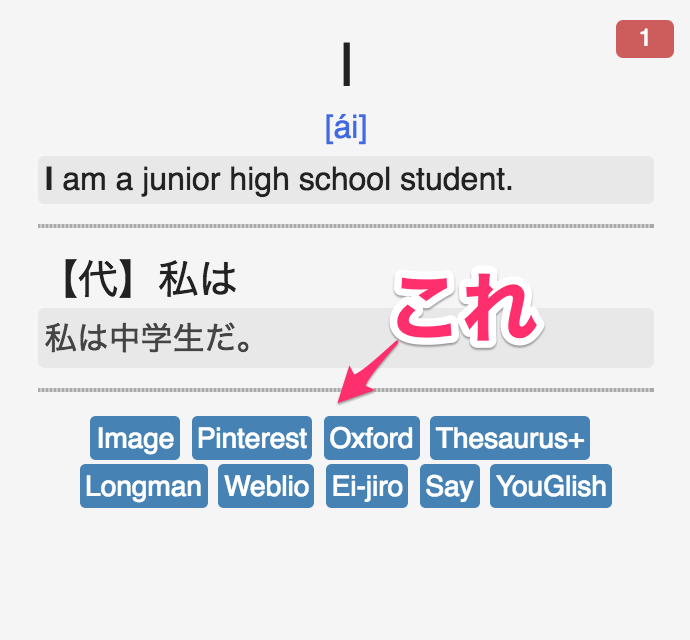
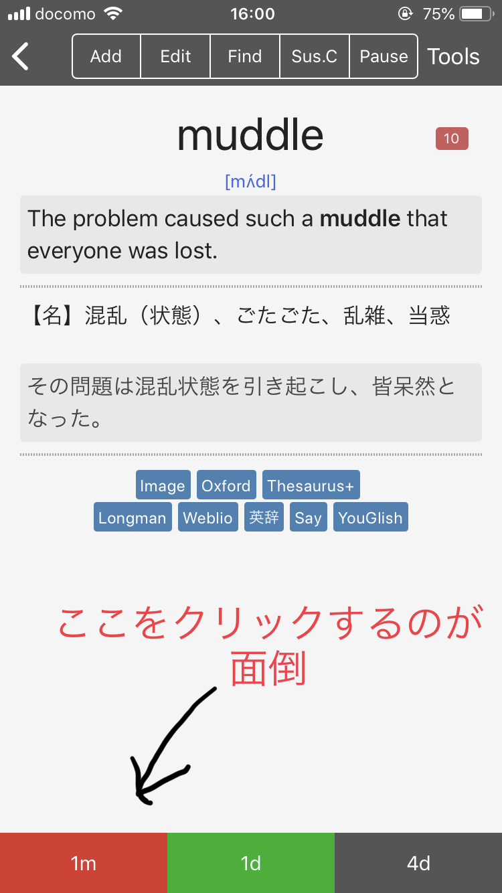
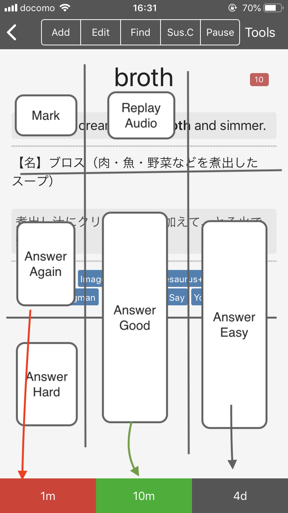
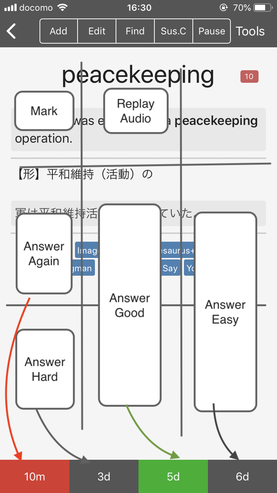
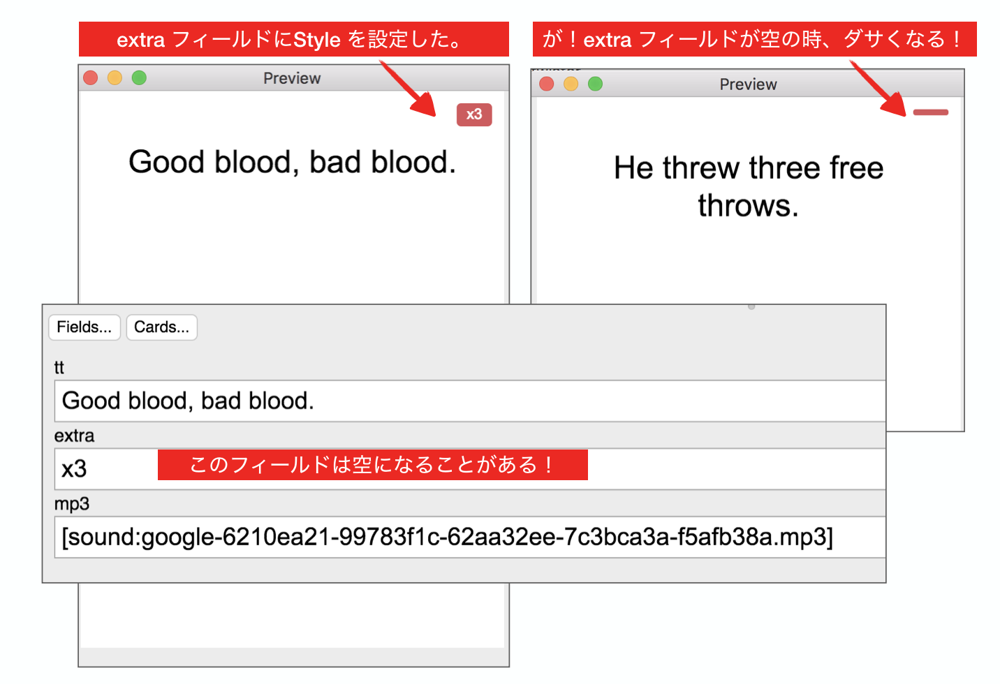
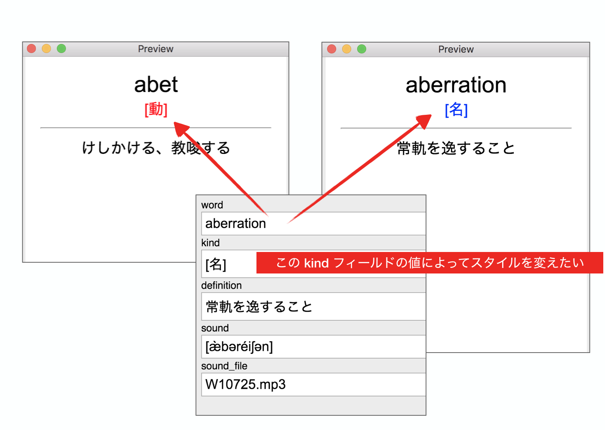
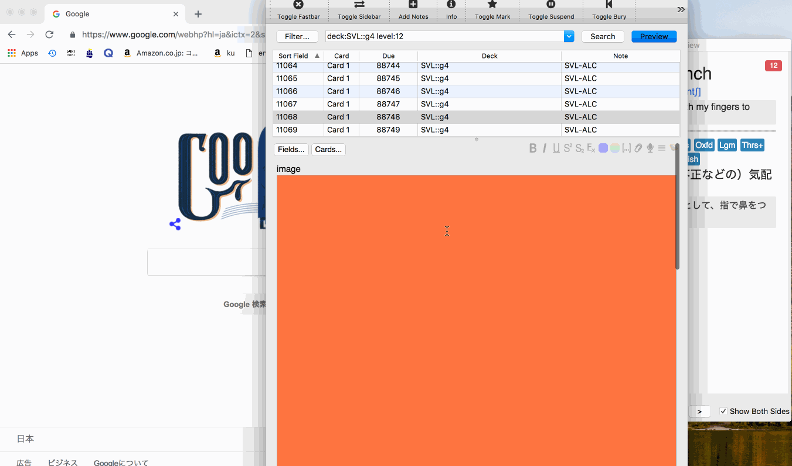
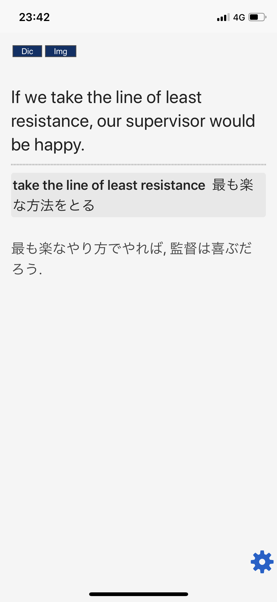
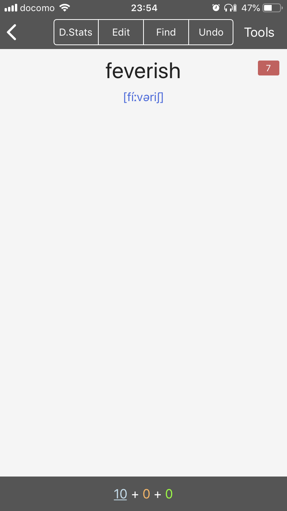
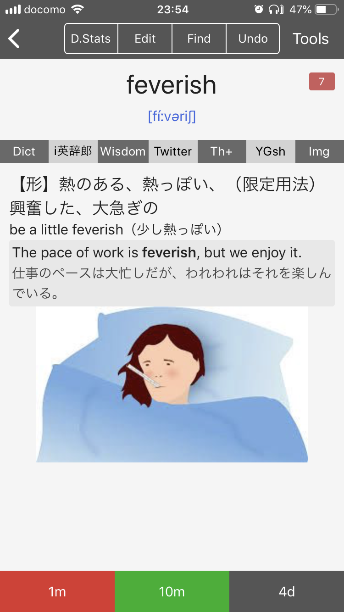

<!-- TOC START min:1 max:3 link:true asterisk:true update:true -->
* [この文書について](#この文書について)
* [TIPS: 便利なリンクのセット](#tips-便利なリンクのセット)
  * [Motivation](#motivation)
  * [Action:Card](#actioncard)
    * [Style](#style)
    * [Front or Back](#front-or-back)
    * [[おまけ] macOS の内蔵辞書、iOS の別アプリの辞書を開く](#おまけ-macos-の内蔵辞書ios-の別アプリの辞書を開く)
* [TIPS: 音声を登録せずに iPhone に読み上げさせる](#tips-音声を登録せずに-iphone-に読み上げさせる)
  * [Motivation](#motivation-1)
  * [Action:Card](#actioncard-1)
    * [Front](#front)
* [TIPS: TAP をカスタマイズしてより Lazy に操作したい](#tips-tap-をカスタマイズしてより-lazy-に操作したい)
  * [Motivation](#motivation-2)
  * [Action:設定変更](#action設定変更)
* [TIPS:必須では無いフィールドにスタイルを設定した時のゴミを消したい](#tips必須では無いフィールドにスタイルを設定した時のゴミを消したい)
  * [Motivation](#motivation-3)
  * [Action:Card](#actioncard-2)
    * [Style](#style-1)
    * [Front](#front-1)
* [TIPS:フィールドのテキスト内容によってスタイルを変えたい](#tipsフィールドのテキスト内容によってスタイルを変えたい)
  * [Motivation](#motivation-4)
  * [Action:Card](#actioncard-3)
    * [Style](#style-2)
    * [Front](#front-2)
* [TIPS: 覚えにくい単語を覚えやすくする為に画像を追加する](#tips-覚えにくい単語を覚えやすくする為に画像を追加する)
  * [Motivation](#motivation-5)
  * [Action:画像を設定しながら、その作業を通じて単語のイメージを育てる](#action画像を設定しながらその作業を通じて単語のイメージを育てる)
    * [image フィールドを広くするには？](#image-フィールドを広くするには)
* [TIPS: テキストを選択したと同時に、選択したテキストを指定した検索エンジンで検索する。](#tips-テキストを選択したと同時に選択したテキストを指定した検索エンジンで検索する)
  * [Motivation](#motivation-6)
  * [Action:Card](#actioncard-4)
    * [Front](#front-3)
    * [Style](#style-3)
    * [Back](#back)
* [TIPS: 実践的なカードStyleの例が欲しい](#tips-実践的なカードstyleの例が欲しい)
  * [Motivation](#motivation-7)
  * [Action:Card](#actioncard-5)
    * [Front](#front-4)
    * [Style](#style-4)
    * [Back](#back-1)
<!-- TOC END -->

# この文書について

- [Anki](https://apps.ankiweb.net/index.html) について、技術的なTIPSをこの文書に書いていきます。  
- [Ankiを始める/紹介する時に必要な情報を集めたページ](https://ei-raku.com/2018/06/learning-anki/) は必読、前提知識とする。  
- 記述のスタイル: TIPS毎に、モチベーション(`Motivation`)を説明し、アクション(`Action`)で解決策を示す。
- 俺の環境: MacBookPro と iPhone(AnkiMobile) です。Windows は持っていません。  

# TIPS: 便利なリンクのセット

## Motivation

完全に初見の単語を覚えるのは辛い。何かしら記憶に引っかかりが欲しい。  
そこで有効なのが Google 画像検索や、英英辞典で別の観点での説明を見たりすることだ。  
これをより気楽にやれるようにするために、カードに辞書検索のリンク集を各カードに表示すれば効率的に検索が行える。  
[Ankiで英単語一覧を取り込む「詳細な」説明](https://ei-raku.com/2018/05/learning-anki-import/) に書いてあった辞書を土台に発展させたものが以下。  



## Action:Card

`{{eng_word}}` は英単語のフィールド名。  
ちなみに僕は省スペースの為に Ei-jiro や Weblio は削除してるし、他のリンクも文字をもっと短縮している。  
各自好きなようにカスタマイズして使ってください。  

### Style

```css
.search {
  display: inline-block;
  font-size: 0.7em;
  color: white;
  background-color: steelblue;
  padding: 0.2em;
  border-radius: 0.2em;
  text-align: center;
}

.search a {
  text-decoration: none;
  color: white !important;
}
```

### Front or Back

```html
<div id="search-group">
  <div class="search"><a href="https://www.google.co.jp/search?q={{eng_word}}&tbm=isch">Image</a></div>
  <div class="search"><a href="https://www.pinterest.jp/search/pins/?q={{eng_word}}">Pinterest</a></div>
  <div class="search"><a href="https://en.oxforddictionaries.com/definition/{{eng_word}}">Oxford</a></div>
  <div class="search"><a href="http://www.colwords.com/#search={{eng_word}}">Colwords</a></div>
  <div class="search"><a href="https://thesaurus.plus/thesaurus/{{eng_word}}">Thesaurus+</a></div>
  <br>
  <div class="search"><a href="https://www.ldoceonline.com/dictionary/{{eng_word}}">Longman</a></div>
  <div class="search"><a href="https://ejje.weblio.jp/content/{{eng_word}}">Weblio</a></div>
  <div class="search"><a href="https://eow.alc.co.jp/search?q={{eng_word}}">Ei-jiro</a></div>
  <div class="search"><a href="https://dopeoplesay.com/q/{{eng_word}}">Say</a></div>
  <div class="search"><a href="https://youglish.com/search/{{eng_word}}">YouGlish</a></div>
</div>
```

### [おまけ] macOS の内蔵辞書、iOS の別アプリの辞書を開く

- `dict://{{keyword}}` 形式のリンクをクリックすると
  - macOSでは内蔵辞書が開く。
  - iPhone(iOS)では(対応アプリがあれば)別の辞書アプリが開く。僕の環境では Longman の英英辞書が開いた
- iOS/macOS では アプリ毎に URL スキーマというのが決まっており、辞書アプリを指定して開くリンクを作ることも可能。下記の２つ目は"ウィズダム英和・和英辞典"へのリンクになっている。URLスキーマはアプリ開発元のサイトを調べて載っている場合もあるし、ない場合は頑張って調べるしか無い。ウィズダム英和辞典のリンクは、公式は[ここ](https://www.monokakido.jp/support/search.html).
- i英辞郎はAppVer 5.5 で動作確認した。
- その他のURLスキームは [パラメータ有りiPhoneアプリのURLスキーム一覧](https://hibikanblog.net/blog-entry-820.html) にも色々載っている。

```html
<div id="search-group">
  <div class="search"><a href="dict://{{eng_word}}">System Dic</a></div>
  <div class="search"><a href="ldoce://{{eng_word}}">Longman 英英</a></div>
  <div class="search"><a href="mkwisdom://jp.monokakido.WISDOM/search?text={{eng_word}}">Wisdom 和英</a></div>
  <div class="search"><a href="com.sokoide.ieijiro://query?input={{eng_word}}">i英辞郎</a></div>
  <div class="search"><a href="twitter://search?query={{eng_word}}">Twitter</a></div>
</div>
```

# TIPS: 音声を登録せずに iPhone に読み上げさせる

## Motivation

単語や文章の音声を用意するのは結構手間だ。  
ネット経由で TTS(Text To Speech) サービスを利用するのも遅延や通信量が嫌だ。  
音声を登録せず、オフラインで音声読み上げできる？ → できる。iPhone なら。  
Anki のカードは実際には Web ページなので、Web Speech API という新しい Webテクノロジーを使って英文を読み上げさせる事ができる。  

- 参考: [iPhone 版 Anki でテキストを読み上げるには](http://rs.luminousspice.com/speech-text-on-ankimobile/)

## Action:Card

### Front

```html
<div id="eng_word">{{eng_word}}</div>

<script>
  var element = document.getElementById("eng_word");
  window.setTimeout("speak(element.innerText)", 500);
  function speak(word) {
    var speech = new SpeechSynthesisUtterance();
    speech.text = word;
    speech.volume = 0.5; // 音量: 0 to 1 (1)
    speech.rate = 1; // 速度: 0.1 to 9 (2)
    speech.pitch = 1; // ピッチ: 0 to 2, 1=normal (3)
    speech.lang = "en-US"; // 言語: アメリカ英語、日本語なら ja-JP (4)
    speechSynthesis.cancel();
    speechSynthesis.speak(speech);
  }
</script>
```

# TIPS: TAP をカスタマイズしてより Lazy に操作したい

## Motivation

iPhone での操作の不満を改善したい。
デッキをこなしていく時、下に表示されるボタンを正確に押すのが面倒。  
かといって、ボタンサイズを大きくすれば説明の表示エリアが狭くなってしまう。  
AnkiMobile の Taps をカスタマイズすることでよりルーズに操作できる様にしたい。  

[注意]
- **ちなみにこのTIPSと"TIPS: 便利なリンクのセット"を組み合わせる場合、リンク集はなるべく上に配置する方が良い(画像ではそうなっていないが。。。)**
- 理由は誤爆を防ぐため。`Answer Good` をしたくて `Mid Center` をタップしたつもりがリンクへジャンプしちゃうのを避けたい。

<p>



</p>

選択肢3つの場合は直感的に対応している。ただ一つの例外は左下(`Bottom Left`) が 選択肢に現れていない`Answer Hard`になっていること。
iPhone を右手で持ち、片手で操作した場合、`Mid Left` と `Mid Center` が最も押しやすく、ここを基本に直感性、使用頻度を考慮してアクションを対応させていく。

- [俺の手の前提条件]: iPhone を主に右手で操作する。指は比較的短い。
- `Answer Again` と `Answer Good` は位置関係からも直感的に理解しやすく押しやすいエリアにする。
- `Answer Easy` と `Answer Hard` は"意識しないとタップできない"エリアに割り当てた。
- `Bottom Left`は親指が届き難く、意識しないとTap出来ない(普通にTapすると `Mid Left` に届く)。
- `Answer Hard` をどこかに割り当てたかったので、わざわざ意識しないと押せない `Bottom Left` に対応させた。
- オーディオ再生の大きなボタンが嫌で、`Audio Buttons` を非表示に設定しているので、`Audio Replay`が出来ない。
- そこでほとんどのカードで単語が表示される `Top Center`の位置をタップすると `Replay Audio` する様にする。

## Action:設定変更

`Preferences > Review > Taps` を選択してTapの設定をカスタマイズする。  
縦に３つ、横に３つでタップエリアを区別してあり、それぞれにアクションが設定できる。  


| WHEN QUESTION SHOWN  |  -           |
| :---                 | :---         |
| TOP Left             |  Show Answer |
| TOP Center           | Replay Audio |
| TOP Right            |  Show Answer |
| Mid Left             |  Show Answer |
| Mid Center           |  Show Answer |
| Mid Right            |  Show Answer |
| Bottom Left          |  Show Answer |
| Bottom Center        |  Show Answer |
| Bottom Right         |  Show Answer |

| WHEN ANSWER SHOWN  |  -            |
| :---               | :---          |
| TOP Left           |  Mark         |
| TOP Center         | Replay Audio  |
| TOP Right          | Off          |
| Mid Left           | Answer Again |
| Mid Center         | Answer Good  |
| Mid Right          | Answer Easy  |
| Bottom Left        | Answer Hard  |
| Bottom Center      | Answer Good  |
| Bottom Right       | Answer Easy  |

# TIPS:必須では無いフィールドにスタイルを設定した時のゴミを消したい

## Motivation

必須ではないフィールドにスタイルを設定すると、文字が空の時にゴミが残ってダサくなってしまう。  
フィールドが空ではない時は表示しないようにしたい。



## Action:Card

### Style

```css
.card {
 font-family: arial;
 font-size: 20px;
 text-align: center;
 color: black;
 background-color: white;
}

#tt {
  font-size: 1.3em;
}

.right {
  position: fixed;
  top: 10px;
  right: 10px;
}

.extra {
  display: inline-block;
  color: white;
  width: 2em;
  background-color: indianred;
  padding: 0.2em;
  border-width: 0px;
  border-radius: 0.3em;
  text-align: center;
  font-size: 0.6em;
}
```

### Front

`<script>`に指定したJavaScript で `extra` フィールド用の DOM Element(`<div id="extra"`>) を取得し、テキストが空だったら非表示 `element.style.display = 'none'` にしている。

```html
<div id="extra" class="right extra">{{extra}}</div>
<br>
<div id="tt">{{tt}}</div>
{{mp3}}

<script>
  var element = document.getElementById("extra");
  if (!element.innerText) element.style.display = 'none';
</script>
```

# TIPS:フィールドのテキスト内容によってスタイルを変えたい

## Motivation

フィールドのテキストの値によって、スタイルを変えたい(色を変えたり、文字列を大きくしたり)。



例は単純だが、応用範囲は広い。  
この例では単純にフィールドの文字列の一致を見て、同じフィールドのスタイルを変えているが、
 - 別のフィールドのエレメントを取得してスタイルを設定することもできるし
  - `getElementById('other_field').classList.add("foo")`
 - 単純な文字列の完全一致ではなく、"含まれるか？"的なチェックも可能だし、
  - `element.innerText.indexOf("注意")`
 - [正規表現でのチェック](https://developer.mozilla.org/ja/docs/Web/JavaScript/Reference/Global_Objects/String/match) もできる。  
  - `element.innerText.match(/bar/)`

## Action:Card

### Style

```css
.card {
  font-size: 20px;
  text-align: center;
  color: black;
  background-color: white;
}

.kind-verb { color: red; }
.kind-noun { color: blue; }
.kind-other { color: black; }
.word { font-size: 1.5em; }
```

### Front

```html
<div class="word">{{word}}</div>
<div id="kind">{{kind}}</div>
[sound:{{sound_file}}]

<script>
  var element = document.getElementById('kind')
  var className
  var kind = element.innerText

  if (kind === '[動]') className = 'kind-verb'
  else if (kind === '[名]') className = 'kind-noun'
  else className = 'kind-other'

  if (className) element.classList.add(className)
</script>
```

# TIPS: 覚えにくい単語を覚えやすくする為に画像を追加する

この TIPS から [Accelerate Image Drag And Drop](https://ankiweb.net/shared/info/283563795) を作りました。よろしければ試してみてください。

## Motivation

- 難し目のレベルの単語集デッキを始めた時、初見の単語が多すぎて暗記が困難。
- 何かしら脳に引っかかりがないと辛い。
- イメージ検索、類義語、対義語検索、英英辞典を検索してイメージを育て、見つけた画像をフィールドに設定することで記憶への引っ掛かりを作りたい。
- この、画像をカードに追加する作業をなるべく効率的に行いたい。

以下の画像では、Anki ブラウザのプレビューウィンドウから以下の２ステップで画像を設定している。

1. 画像検索リンクをクリック、
2. ブラウザで開いた画像を、image フィールド(オレンジの領域)にドロップ



## Action:画像を設定しながら、その作業を通じて単語のイメージを育てる

**[注意] 画像やテキストには著作権がある場合があるので注意！**

上述のアニメーションGIFのポイントは以下

- イメージ設定用のフィールド(例では `image`フィールド)を先頭のフィールドにしておく:
  - 例えば最後のフィールドだった場合、それ以前のフィールドのテキスト量が多い場合、イメージフィールドを表示するのに、スクロールする必要がでてくる。先頭にしておけばそういうことはない。
- アドオンを使ってイメージ用フィールドを大きくしておく:
  - イメージ設定用フィールドは空なので、画像をドロップする際、細やかなコントロールが必要になる。このフィールドの高さがもっと高ければ、画像をドロップしやすいのに！→ それを可能にするアドオンがある！
- 画像検索はプレビューウィンドウのリンククリックで行う:
  - 別のTIPSで紹介した"TIPS: 便利なリンクのセット"をカードに表示しておけば、マウスクリックだけで画像検索ができる。

### image フィールドを広くするには？

1. [Customize Editor Stylesheet](https://ankiweb.net/shared/info/1215991469) をインストール。
2. collection.media フォルダ配下に、以下の内容の `_editor.css` ファイルを作る。

```css
#f0 { # "#f0" は1番目のフィールドに設定される id. 2番目なら"#f1"
  height: 300px; # 高さは500pxとか好きなように変えてください。
  background-color: coral ! important;
}
```

`collection.media` の場所は `anki collection.media` で検索すればすぐ見つかります。
`Preferences > Backups > Open backup folder` で開く、バックアップフォルダと同じ階層にある。

3. Ankiを再起動して、ブラウザを開き、デッキを選択。先頭のフィールドに色がついて、高さが変わっていたら成功。
4. ひたすら広くなったフィールドに画像をドロップしていく。。。。。
5. 終わったら。`_editor.css` をまるごと削除するなりして元に戻す。

# TIPS: テキストを選択したと同時に、選択したテキストを指定した検索エンジンで検索する。

## Motivation

例文を読んでいて分からない単語が出てくる場合がある。

この単語を画像検索や、辞書検索するには、単語を選択し、コピーし、辞書アプリやブラウザの検索ウィンドウに貼り付けて検索し、、、という手間が発生する。
もっと気楽に検索できるようにしたい。iPhoneだと、単語の上で指をプレスすると、自動で単語を選択してくれる。選択したと同時に外部の辞書アプリや、Google画像検索で画像を検索できればいいのに！！

例えば以下のようなSIL(ALCが出している句動詞、熟語の頻出リスト)を覚える場合、とりあえずは受動的に理解できれば良いので、例文を主軸にカードをつくるような場合を想定している。

- 単語を選択した時点で、指定した検索エンジンで選択したテキストを検索する。
- button に割り振った `id` は `getSearchLink` へのキーになる。
- 例えば `search-img` のボタンをクリックすると `https://www.google.com/search?q=___SEARCH___&tbm=isch`(`___SEARCH___` は選択したテキストに置き換わる) が検索される。
- 独自の辞書を追加したければ、 `button` を追加、`getSearchLink`を変更の２ステップで可能。コメントアウトされた `ieijiro` のサンプルが参考になるはず。
- `search-dic` はiOSでは Wisdom 辞書に、macOS上ではシステム辞書に対応させている。
- `rememberCurrentSearch`を`false`にすれば、直近の検索エンジンを記憶しないようになる。



## Action:Card

### Front

```html
<div class="front">
  <div id="search-kind" class="btn-group">
    <button id="search-dic">Dic</button>
    <button id="search-img">Img</button>
    <!-- <button id="search-eijiro">eijiro</button> -->
  </div>
  <br>
  <br>
  <!-- <div id='status'>N/A</div> -->
  <spam class="sen-en">{{sen-en}}<br></spam>
</div>

<script>
  var rememberCurrentSearch = true; // maintain last search kind on next card.
  var attributeKey = "data-TIPS-current-search";
  var defaultSearch = "search-dic";

  if (!rememberCurrentSearch || !getCurrentSearch()) {
    setCurrentSearch(defaultSearch);
  }
  document.onmouseup = document.onkeyup = document.onselectionchange = handleSelection;

  function setCurrentSearch(text) {
    document.body.setAttribute(attributeKey, text);
  }
  function getCurrentSearch() {
    return document.body.getAttribute(attributeKey);
  }
  function getSearchLink(key, text) {
    var link = "";
    switch (key) {
      case "search-dic":
        if (isIOS()) {
          link = "mkwisdom://jp.monokakido.WISDOM/search?text=___SEARCH___";
        } else {
          link = "dict://___SEARCH___";
        }
        break;
      case "search-img":
        link = "https://www.google.com/search?q=___SEARCH___&tbm=isch";
        break;
      // case "search-eijiro":
      //   link = "com.sokoide.ieijiro://query?input=___SEARCH___";
      //   break;
    }
    return link.replace("___SEARCH___", text);
  }
  function handleSelection(event) {
    var searchKind = document.getElementById("search-kind");
    if (searchKind.contains(event.target)) {
      setCurrentSearch(event.target.id);
    }

    var text = window.getSelection().toString();
    if (text) {
      var element = document.createElement("a");
      element.setAttribute("href", getSearchLink(getCurrentSearch(), text));
      document.body.appendChild(element);
      element.click();
      element.remove();
    }
  }
  function isIOS() {
    return /iPad|iPhone|iPod/.test(navigator.userAgent) && !window.MSStream;
  }
  function setStatus(text) {
    document.getElementById("status").innerText = text;
  }
</script>
```

### Style

```css
.card {
  /* font-family: arial; */
  font-size: 20px;
  text-align: left;
  color: #222222;
  background-color: whitesmoke;
}

hr#answer {
  border: 1px dotted #8c8b8b;
  border-color: darkgray;
}

.sen-en { font-size: 1.2em; }
.sen-ja { color: #444444; }

.definition {
  background-color: #e8e8e8;
  padding: 0.1em;
  border-width: 0px;
  border-radius: 0.2em;
  border-style: solid;
  border-color: tomato;
  text-align: left;
}
.sil-en { font-weight: bold; font-size: 0.9em; }
.sil-ja { font-size: 0.7em; }

.btn-group button {
  -webkit-appearance: none;
  -moz-appearance: none;
  appearance: none;
  background-color: #063168;
  color: white; /* White text */
  /* border: none; */
  /* padding: 10px 24px; /* Some padding */ */
  cursor: pointer; /* Pointer/hand icon */
  float: left; /* Float the buttons side by side */
}
```

### Back

```html
<div class="back">
  {{FrontSide}}
  <hr id="answer">
  <div class="definition">
    <spam class="sil-en">{{sil-en}}</spam> &nbsp<spam>{{sil-ja}}<br></spam>
  </div>
  <div class="sen-ja"><br>{{sen-ja}}</div>
</div>
```

# TIPS: 実践的なカードStyleの例が欲しい


## Motivation

抜粋ではなく、サンプルとして具体的に使っているカードとスタイルの例を見たい。  
そのサンプルを土台としてカスタマイズしていきたい。  

以下は t9md が SVL を覚えるのに使っているカード。  
Audio Play 用のボタンは表示していないので場所はテキトウ。  

<p>


</p>

## Action:Card

### Front

```html
<div class="front">
  <div class="eng_word">{{eng_word}}</div>
  <div class="sound">{{sound}}</div>
  <div>{{sound_file}}</div>
  <div class="svl">{{level}}</div>
</div>
```

### Style

```css
.card {
  margin: 0px;
  font-size: 20px;
  text-align: center;
  color: #222222;
  background-color: whitesmoke;
}

.front,
.back {
  margin: 10px;
}

hr {
  border: 1px dotted #8c8b8b;
  border-color: darkgray;
}

.eng_word {
  font-size: 1.5em;
}

.sound {
  color: royalblue;
  padding: 0.3em;
  font-size: 0.8em;
}

.explain {
  text-align: left;
}
.usage,
.memo,
image-caption {
  font-size: 0.8em;
}

.example {
  background-color: #e8e8e8;
  padding: 0.2em;
  border-width: 0px;
  border-radius: 0.2em;
  border-style: solid;
  border-color: tomato;
  font-size: 0.8em;
  text-align: left;
}

.jap_sen {
  color: #444444;
}

.svl {
  display: inline-block;
  color: white;
  width: 2em;
  background-color: indianred;
  padding: 0.2em;
  border-width: 0px;
  border-radius: 0.2em;
  text-align: center;
  font-size: 0.6em;

  position: fixed;
  top: 5px;
  right: 10px;
}

#search-group {
  /* border-style: solid; */
  /* border-width: 1px; */
  /* border-color: 1px; */
  display: flex;
}

.search {
  height: 20px;
  line-height: 20px;
  width: 100%;
  font-size: 0.7em;
  padding: 0.2em;
  border-color: black;
  border-width: 0px;
}

.search:nth-child(odd) {
  background-color: dimgray;
}
.search:nth-child(even) {
  background: lightgray;
}

.search a {
  vertical-align: center;
  text-decoration: none;
}
.search:nth-child(odd) a {
  color: white !important;
}
.search:nth-child(even) a {
  color: black !important;
}
```

### Back

```html
{{FrontSide}}

<div id="search-group">
  <div class="search"><a href="dict://{{eng_word}}">Dict</a></div>
  <div class="search"><a href="com.sokoide.ieijiro://query?input={{eng_word}}">i英辞郎</a></div>
  <div class="search"><a href="mkwisdom://jp.monokakido.WISDOM/search?text={{eng_word}}">Wisdom</a></div>
  <div class="search"><a href="twitter://search?query={{eng_word}}">Twitter</a></div>
  <div class="search"><a href="https://thesaurus.plus/thesaurus/{{eng_word}}">Th+</a></div>
  <div class="search"><a href="https://youglish.com/search/{{eng_word}}">YGsh</a></div>
  <div class="search"><a id="primal-image-link" href="https://www.google.co.jp/search?q={{eng_word}}&tbm=isch">Img</a></div>
</div>

<div class="back">
  <div class="explain">
    <div class="jap_word">{{meaning}}<br></div>
    <div class="usage">{{usage}}</div>
    <div class="memo">{{memo}}</div>
  </div>
  <div class="example">
    <spam class="eng_sen">{{eng_sen}}<br></spam>
    <spam>{{eng_sen_sound_file}}</spam>
    <spam class="jap_sen">{{jap_sen}}<br></spam>
  </div>
  <div class="representing-image">
    <div style="font-size: 0.7em;">{{image_caption}}</div>
    <div>{{image}}</div>
  </div>
</div>
```
