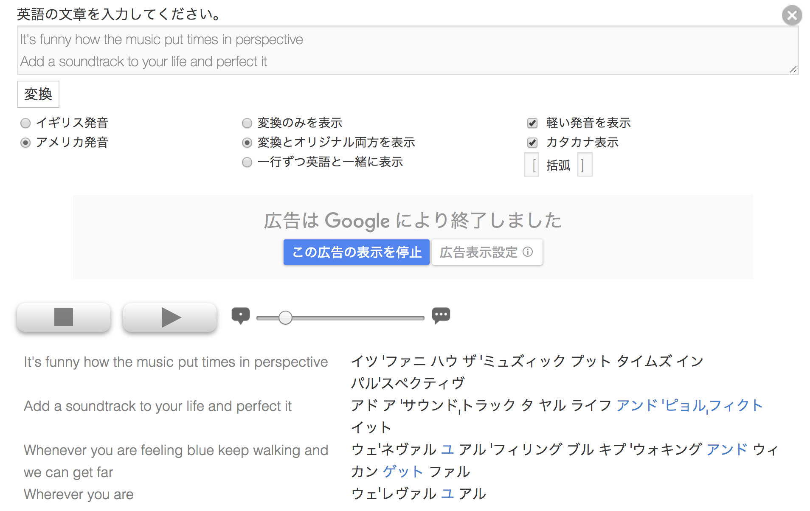
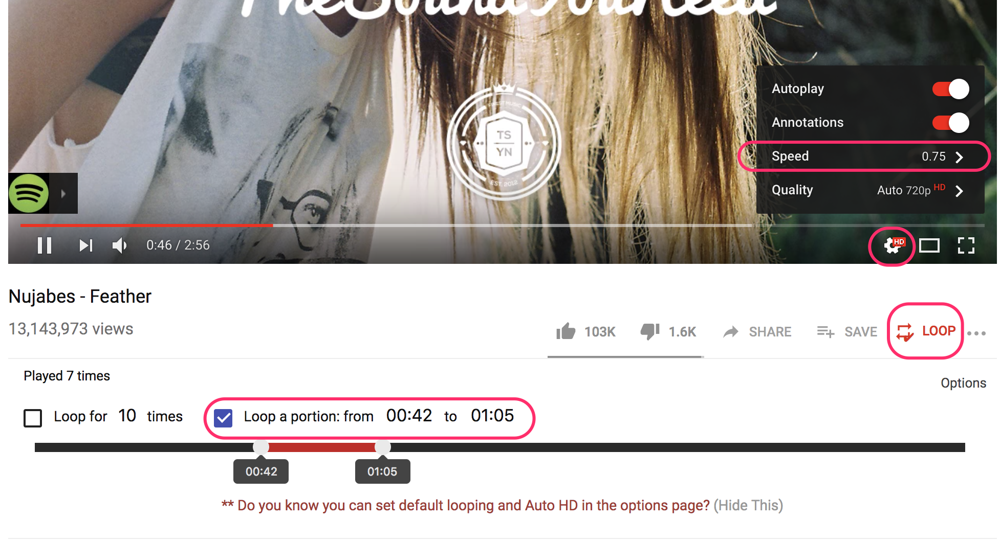
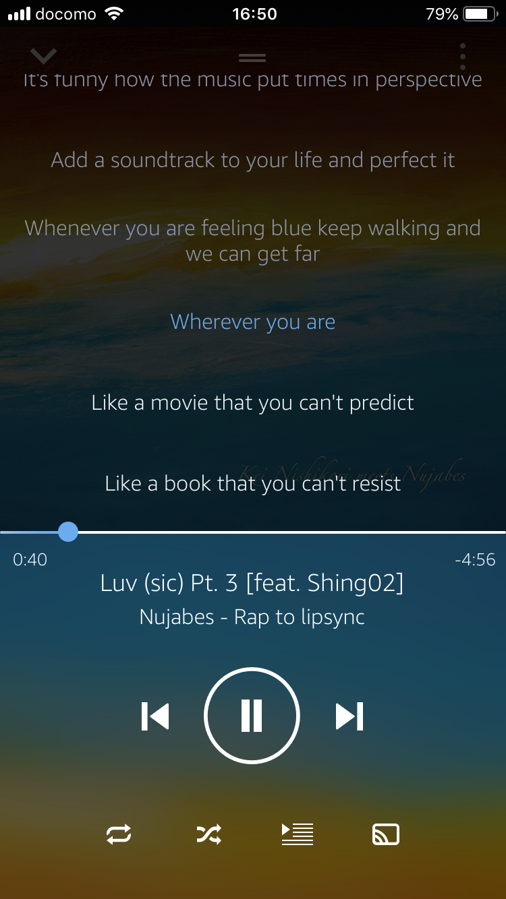

<!-- TOC START min:1 max:3 link:true asterisk:true update:true -->
* [人・Blog](#人blog)
  * [先人達の記事](#先人達の記事)
  * [多読って有用なの？そもそも何？的な疑問に対する回答](#多読って有用なのそもそも何的な疑問に対する回答)
  * [その他](#その他)
  * [本を選ぶ時に参考になるサイト](#本を選ぶ時に参考になるサイト)
* [図書館・多読ブッククラブ](#図書館多読ブッククラブ)
* [サービス・ツール](#サービスツール)
  * [レプトン・リーディングファーム](#レプトンリーディングファーム)
  * [Scribd](#scribd)
  * [Netflix](#netflix)
  * [Mouse Dictionary](#mouse-dictionary)
* [その他](#その他-1)
  * [リスニング](#リスニング)
  * [ライティング](#ライティング)
  * [発音](#発音)
    * [ELSA Speak](#elsa-speak)
    * [tophonetics](#tophonetics)
    * [iPhone/macOS のスピーチ機能](#iphonemacos-のスピーチ機能)
    * [洋楽を歌う](#洋楽を歌う)
    * [Articulation](#articulation)
* [英会話, fluency](#英会話-fluency)
* [CHANGELOG](#changelog)
<!-- TOC END -->

多読を行っている t9md が多読を始める(実は再開)にあたり有用と思った情報をまとめて、コメントしてます。

# 人・Blog

## 先人達の記事

多読の先人達の記事を読んで、モチベーションを高めたり、襟を正したりしてみよう。  
記事への直リンクを貼っています。

- [英語上達完全マップを10ヶ月やってみた](http://kanzenmap.nomaki.jp/)
- [多読１０年間のまとめ①　読了冊数、語数、YLの推移](http://yukomillennium.com/?p=5725)
- [英語｢超｣上級者は例外なく多聴多読していた件](http://enjoylifeinenglish.blog112.fc2.com/blog-entry-106.html)
- [読んで読んで読みまくれ！多読・多聴が欠かせない！](http://mekarourokoeigo.hatenablog.com/entry/2015/10/09/101515)

## 多読って有用なの？そもそも何？的な疑問に対する回答

- [理想の英語学習とは？　最新の言語学研究より](http://mekarourokoeigo.hatenablog.com/entry/2015/10/17/170021)
- [本の紹介: 英語ができないあなたは悪くない！](http://mekarourokoeigo.hatenablog.com/entry/2016/05/30/190000)
- [多読・Tadoku入門](https://tadoku.org/english/)
- [Brighture ブログ 日本人はなぜ英語をスラスラと話せないのか？](https://brighture.jp/b-blog/1651) ※ この他にも Brighture の Blog(松井博氏の記事)はどれもオススメ

## その他

- [えいらく](https://ei-raku.com/)
  - 超優良サイト、ゲームや漫画を通して、楽しんで英語に触れる方法の紹介。サイトの登録方法等を含め、"はじめ方"がとても親切にかかれていて素晴らしすぎる。このサイトから多読のための様々なサービス、アプローチに出会える！

## 本を選ぶ時に参考になるサイト

特に初期の頃は、面白く読め、かつ読みやすい本に出会えると大きく弾みがつく。
読みやすく、面白そうなシリーズを見つける上で、下記のリンクは参考になる。

- [多読王国 シリーズ紹介](https://tadoking.com/series/)
- [ＳＳＳ推薦・多読用基本洋書のご紹介](https://www.seg.co.jp/sss/review/osusume.html)
- [外国語検定奮闘記 多読の本棚](http://www.kiriusa.com/living/examination/index.html#tadoku) 紹介の仕方がすばらしく、読みたくさせる。
- [多聴多読ステーション YL別検索](https://www.kikuyomu.com/ylsearch.php)

# 図書館・多読ブッククラブ

多読用の物理本(e-bookではないもの)を借りる場合、こんな選択肢がある。

- [四谷図書館](https://www.library.shinjuku.tokyo.jp/facility/yotsuya.html): 新宿区・四谷の図書館、多読の本多数. [ここで検索できる](https://www.library.shinjuku.tokyo.jp/WebOpac/webopac/selectsearch.do?searchkbn=0&histnum=1)
- [SEG社会人ブッククラブ](http://www.seg.co.jp/bookclub/)
- [NPO多言語多読の講座](https://tadoku.org/english/tadoku-courses/)を受講すると、ライブラリにある本も借りられる。北新宿にある
- [多読用図書が読める図書館リスト](http://www.cosmopier.com/library/): これが全てではない or 情報が最新ではない、という印象

# サービス・ツール

## [レプトン・リーディングファーム](https://www.reading-farm.jp/)

- アメリカの小学生向けの本が1000冊、月額980円で読み放題。多読の初期は読むものを探すのが辛かったり金がかかるのでこれは助かる。
- 全ての本にネイティブの朗読付き。対応する文字もハイライトされるのでどこを読んでいるか分かる。
- サービス運営側は、基本的に子供が使う事を想定しているようだ。
- "えいらく"に[わかりやすい説明記事](https://ei-raku.com/2018/08/tadoku-reading-farm/)がある!

## [Scribd](https://www.scribd.com/)

- 年契約すると20%のオファーもらえるので月額750円位だった(111円/$の時で)。
- 2018年2月から、月額固定で(ほぼ)読み放題のサービスが始まったようだ。
- 何が良いかというと本だけではなく、Audiobookも聴ける点。相当英語力がつかないとAudiobookのみで内容をちゃんと理解するのは難しい。AmazonでAudibleを買ってもレベルが合わず、買っただけ。という状態にもなりがちだ。ScribdならAudiobookをいくら聴いてもお金はかからないので、気楽に色々試し聞きできる。
- 多読の中級者におすすめの "Who is(was)" シリーズも沢山ある。

## [Netflix](https://www.netflix.com/)

- 動画サービス。月額制。Amazon Video と違い字幕版と吹替版で動画が分かれていない。一つの動画で字幕や音声言語を選べる。Amazon Videoでは出来ない字幕を消すことや、日本語音声・英語字幕もできる。英語字幕があるのがリスニングを鍛える時に使える。
- Chrome 拡張で、英語・日本語のダブル字幕同時表示ができるようにすることも出来る
  - 一番オススメ: LLN(単語登録等一部の機能は有料だが、無料でほとんど事足りる)
    - [Language Learning with Netflix](https://chrome.google.com/webstore/detail/language-learning-with-ne/hoombieeljmmljlkjmnheibnpciblicm)
    - [Language Learning with Youtube](https://chrome.google.com/webstore/detail/language-learning-with-yo/jkhhdcaafjabenpmpcpgdjiffdpmmcjb)
    - [Bookmarklet to copy subtitles when you are using LLN(for Netflix)+LLY(for Youtube)](https://gist.github.com/t9md/c5f73108265a1497289467580a3161eb)
  - 無料: [NflxMultiSubs](https://chrome.google.com/webstore/detail/nflxmultisubs-netflix-mul/pjhnilfooknlkdonmjnleaomamfehkli)
  - 有料: [Netflix 同時字幕で英語学習](https://chrome.google.com/webstore/detail/netflix-%E5%90%8C%E6%99%82%E5%AD%97%E5%B9%95%E3%81%A7%E8%8B%B1%E8%AA%9E%E5%AD%A6%E7%BF%92/gibmkmmdicoffkhjkfimmjkojjopoagg)
    - ちょい巻き戻しや、字幕位置の固定、再生スピードの変更、それぞれにショートカットが用意されている等、カユイところに手が届く感じ。
    - 昔ソースネクストが"超字幕"というソフトを出していて１話毎に購入する必要があったが、エライ時代になったもんだ。とても良いです。

## [Mouse Dictionary](https://chrome.google.com/webstore/detail/mouse-dictionary/dnclbikcihnpjohihfcmmldgkjnebgnj)

- Chrome ブラウザ用の機能拡張
- 格安な Scribd での多読に更に強力な味方(パソコンで読む人なら)になるでしょう！
- ローカルに辞書データ持つので高速。英辞郎インポート可能
- [作者による記事](https://qiita.com/wtetsu/items/c43232c6c44918e977c9)を見ると色々分かります。

# その他

## リスニング

素材
- [culips.com](https://www.culips.com/)
- [Randall's ESL Cyber Listening Lab](https://www.esl-lab.com/index.htm)
- [Videos in Levels](http://www.videosinlevels.com/)
- [elllo](http://www.elllo.org/)

## ライティング

Tools
- [Grammarly](https://www.grammarly.com/) 文法チェックツール、スタンドアロンアプリ、Web版、Chrome プラグインがある。単純な文法エラーに加え、前置詞の誤りや、類語への置き換えも補助してくれる
- [ludwig](https://ludwig.guru/) 用語の使用例を NYT, Wikipedia, Forbes 等から検索できる
- [Google 翻訳](https://translate.google.co.jp/): 英文を書いて日本語として意味あるものになるか的なチェックが便利

## 発音

### [ELSA Speak](https://elsajapan.com/)

アメリカ英語発音限定だが、発音をマイクに録音し、クラウドに送ることで不明瞭な発音を指摘してくれる。  
発音を独学をしている場合でもこういうソフトである程度客観的なフィードバックを受けながら行うほうが安心だし、モチベーションも得られる。  
すごい時代になった。超オススメ。  

### [tophonetics](https://tophonetics.com/)

文章を貼り付けると IPA 発音記号化してくれる。  

IPA 化された発音記号を読むことはもちろん役立つ。が、その他にも面白い機能がある。日本語のメニューでは変換時に"カタカナ表示"が選べる。これを馬鹿にしてはいけない。日本人発音の良くある間違いは、アルファベットを見て、フォニックス(Phonics)読みではなく、ローマ字読みしてしまう所だ。"カタカナ表示"の出力はローマ字読みのカタカナでは無いので、声に出して読んでみるとローマ字読みの悪い癖に気づかせられる。僕は"ローマ字読みの悪い癖をほぐす"目的で補助的に使っている。

### iPhone/macOS のスピーチ機能

アクセシビリティ → スピーチから有効にすれば、テキストの読み上げ(スクリーン or 選択範囲)が可能
iPhone はスピーチに Siri の声が選べる。macOS では選べない。個人的には iPhone の Siri の読み上げが最も自然に感じる。

### 洋楽を歌う

#### 練習のステップ

- 歌詞の発音を tophonetics に貼り付けて発音確認し、word, sentence 毎に仕上げつつ、Youtube で歌詞付きの歌を見つけて何度も練習する。
- 歌えるまでのSteps: 僕は一応このステップを意識しつつ、1-4を薄く重ね塗りの要領で繰り返し、完成度を徐々に上げる作戦でやっている。僕はこれで rap を練習している。

1. Wordを仕上げる、Sentence を仕上げる。
2. 朗読する、できる
3. 速度を落として再生してついていける
4. 標準速度でついていける

#### Youtube

- 練習時に使える機能とショートカット
  - `<`, `>`: 再生速度変更(`0.5`, `0.75`, `Normal`, `1.25` をキーボードで切り替える)
  - `0`...`9`: 相対的な再生位置の指定。`0` だと最初. `9`だと最後。
  - `f`: フルスクリーン
  - `c`: キャプション表示(歌詞がキャプションとして登録されているものは結構ある)
  - `+`, `-`: キャプションサイズの変更
- [Youtube Looper](https://chrome.google.com/webstore/detail/youtube-looper/bidjeabmcpopfddfcnpniceojmkklcje) を Chrome に入れれば指定した部分のみループ出来るようになる。

#### Amazon Music Player

Amazon プライムに加入していれば聴けるプライムミュージックのプレイヤーは歌詞が表示でき、歌っている箇所がハイライトされるし、歌詞クリックで該当箇所に飛べるので部分練習に便利。再生速度の変更は出来ないのと、全ての歌が歌詞サポートしている訳ではない。

### Articulation

- [アメリカ英語の発音ノウハウ (2) ～ 舌のホームポジション](http://tomoto335.hatenablog.com/entry/american-english/02)
- [首の根元を定位置として英語を発音・発声するとよい](https://www.youtube.com/watch?v=waAY-Qkavhs)
- [英語を話すのに必要な、３つのポイント](https://englishbootcamp.jp/?p=1939)

# 英会話, fluency

- 会話は総合力
  - ボキャブラリ
  - 作文能力
  - 声の大きさ、良さ
  - 発音のわかり易さ
    - 子音の明確さ、母音の響き
    - イントネーションと自然さ(effortlessness, リエゾン, リダクション etc)
  - 背景知識
  - 身振り手振り、表情

語学学習は終わりがないマラソンだ。情報もいっぱいあって溺れそうになる。そんな時僕は以下の記事を羅針盤にしている。  
どちらも嘘がなく、泥臭いプロセスをさらけ出していてやる気が感染する感じ。素晴らしい！  

- [Bob](https://twitter.com/Bobinglish) さん
  - [僕はこうやって英語が話せるようになった](http://sky-rocket-english.com/my-english-learning-story/)
  - [僕の英語発音はEllegardenというバンドの出会いから](https://note.mu/bobengdom/n/na860d42ccf19)
- [新井リオ](https://twitter.com/_arairio) さん
  - [独学3年間の努力と道のり。日本で英語が話せるようになった僕の勉強法](http://arairio.com/english/how-to-study)
  - [僕が英語の「独学」にこだわる理由。欧米への語学留学が全てではない。](http://arairio.com/english/18_06_22)

# CHANGELOG

- 2020-05-14: LLN+LLY、及び字幕保存のBookmarkletへのリンクを追加
- 2018-11-07: 英会話のコーナー + Bobさん、新井リオさんの記事へのリンクを追加、発音: ELSA Speak の紹介
- 2018-10-29: ライティング、発音のセクションを追加
- 2018-09-18: リスニング素材・本を選ぶ時に参考になるサイト・Brighture Blog への記事リンクを追加
- 2018-09-07: 初期リリース
