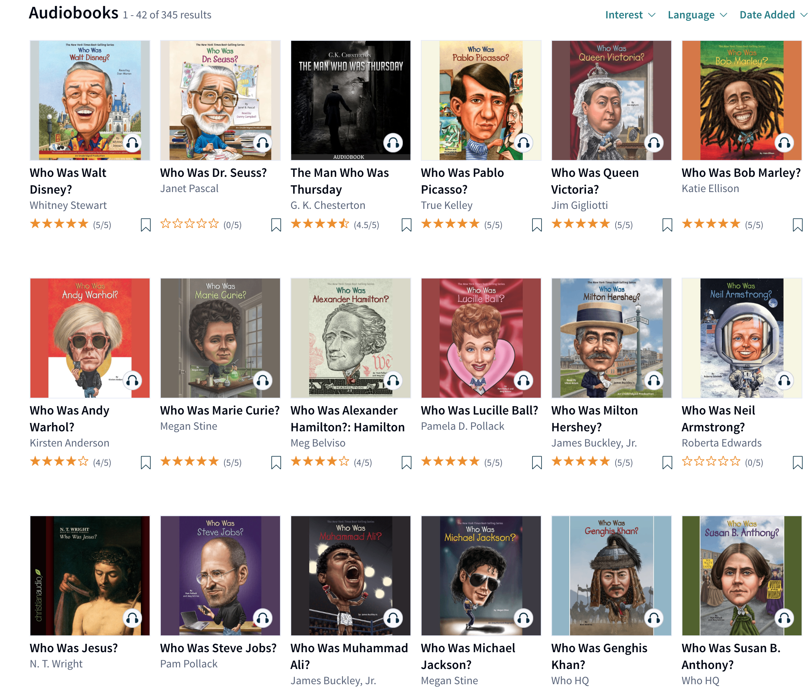
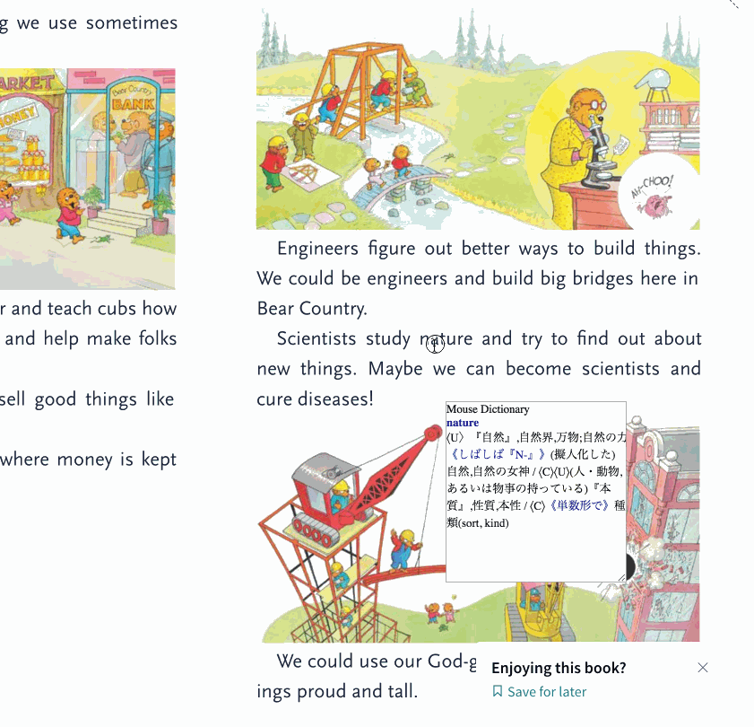

<!-- TOC START min:1 max:3 link:true update:true -->
- [人・Blog](#人blog)
  - [先人達の記事](#先人達の記事)
  - [多読って有用なの？そもそも何？的な疑問に対する回答](#多読って有用なのそもそも何的な疑問に対する回答)
  - [その他](#その他)
  - [本を選ぶ時に参考になるサイト](#本を選ぶ時に参考になるサイト)
- [図書館・多読ブッククラブ](#図書館多読ブッククラブ)
- [サービス・ツール](#サービスツール)
  - [レプトン・リーディングファーム](#レプトンリーディングファーム)
  - [Scribd](#scribd)
  - [Netflix](#netflix)
  - [Mouse Dictionary](#mouse-dictionary)
  - [リスニング素材](#リスニング素材)
- [CHANGELOG](#changelog)

<!-- TOC END -->

多読を行っている t9md が多読を始める(実は再開)にあたり有用と思った情報をまとめて、コメントしてます。

# 人・Blog

## 先人達の記事

多読の先人達の記事を読んで、モチベーションを高めたり、襟を正したりしてみよう。  
記事への直リンクを貼っています。

- [英語上達完全マップを10ヶ月やってみた](http://kanzenmap.nomaki.jp/)
- [多読１０年間のまとめ①　読了冊数、語数、YLの推移](http://yukomillennium.com/?p=5725)
- [英語｢超｣上級者は例外なく多聴多読していた件](http://enjoylifeinenglish.blog112.fc2.com/blog-entry-106.html)
- [読んで読んで読みまくれ！多読・多聴が欠かせない！](http://mekarourokoeigo.hatenablog.com/entry/2015/10/09/101515)

## 多読って有用なの？そもそも何？的な疑問に対する回答

- [理想の英語学習とは？　最新の言語学研究より](http://mekarourokoeigo.hatenablog.com/entry/2015/10/17/170021)
- [本の紹介: 英語ができないあなたは悪くない！](http://mekarourokoeigo.hatenablog.com/entry/2016/05/30/190000)
- [多読・Tadoku入門](https://tadoku.org/english/)
- [Brighture ブログ 日本人はなぜ英語をスラスラと話せないのか？](https://brighture.jp/b-blog/1651) ※ この他にも Brighture の Blog(松井博氏の記事)はどれもオススメ

## その他

- [えいらく](https://ei-raku.com/)
  - 超優良サイト、ゲームや漫画を通して、楽しんで英語に触れる方法の紹介。サイトの登録方法等を含め、"はじめ方"がとても親切にかかれていて素晴らしすぎる。このサイトから多読のための様々なサービス、アプローチに出会える！

## 本を選ぶ時に参考になるサイト

特に初期の頃は、面白く読め、かつ読みやすい本に出会えると大きく弾みがつく。
読みやすく、面白そうなシリーズを見つける上で、下記のリンクは参考になる。

- [多読王国 シリーズ紹介](https://tadoking.com/series/)
- [ＳＳＳ推薦・多読用基本洋書のご紹介](https://www.seg.co.jp/sss/review/osusume.html)
- [外国語検定奮闘記 多読の本棚](http://www.kiriusa.com/living/examination/index.html#tadoku)
- [多聴多読ステーション YL別検索](https://www.kikuyomu.com/ylsearch.php)

# 図書館・多読ブッククラブ

- [四谷図書館](https://www.library.shinjuku.tokyo.jp/facility/yotsuya.html): 新宿区・四谷の図書館、多読の本多数. [ここで検索できる](https://www.library.shinjuku.tokyo.jp/WebOpac/webopac/selectsearch.do?searchkbn=0&histnum=1)
- [SEG社会人ブッククラブ](http://www.seg.co.jp/bookclub/)
- [NPO多言語多読の講座](https://tadoku.org/english/tadoku-courses/)を受講すると、ライブラリにある本も借りられる。北新宿にある
- [多読用図書が読める図書館リスト](http://www.cosmopier.com/library/): これが全てではない or 情報が最新ではない、という印象

# サービス・ツール

## [レプトン・リーディングファーム](https://www.reading-farm.jp/)

- アメリカの小学生向けの本が1000冊、月額980円で読み放題。多読の初期は読むものを探すのが辛かったり金がかかるのでこれは助かる。
- 全ての本にネイティブの朗読付き。対応する文字もハイライトされるのでどこを読んでいるか分かる。
- サービス運営側は、基本的に子供が使う事を想定しているようだ。
- "えいらく"に[わかりやすい説明記事](https://ei-raku.com/2018/08/tadoku-reading-farm/)がある!

## [Scribd](https://www.scribd.com/)

- 年契約すると20%のオファーもらえるので月額750円位だった(111円/$の時で)。
- 2018年2月から、月額固定で(ほぼ)読み放題のサービスが始まったようだ。
- 何が良いかというと本だけではなく、Audiobookも聴ける点。相当英語力がつかないとAudiobookのみで内容をちゃんと理解するのは難しい。AmazonでAudibleを買ってもレベルが合わず、買っただけ。という状態にもなりがちだ。ScribdならAudibleをいくら聴いてもお金はかからないので、気楽に色々試し聞きできる。
- 多読の中級者におすすめの "Who is(was)" シリーズも沢山ある

## [Netflix](https://www.netflix.com/)

- 動画サービス。月額制。Amazon Prime と違い字幕版と吹替版で動画が分かれていない。一つの動画で字幕や音声言語を選べる。
- なので字幕を消すことも出来る.日本語音声・英語字幕もできる。英語字幕があるのがリスニングを鍛える時に使える。
- Chrome 拡張で、英語・日本語のダブル字幕同時表示ができるようにすることも出来る
  - 無料: [NflxMultiSubs](https://chrome.google.com/webstore/detail/nflxmultisubs-netflix-mul/pjhnilfooknlkdonmjnleaomamfehkli)
  - 有料: [Netflix 同時字幕で英語学習](https://chrome.google.com/webstore/detail/netflix-%E5%90%8C%E6%99%82%E5%AD%97%E5%B9%95%E3%81%A7%E8%8B%B1%E8%AA%9E%E5%AD%A6%E7%BF%92/gibmkmmdicoffkhjkfimmjkojjopoagg)
    - ちょい巻き戻しや、字幕位置の固定、再生スピードの変更、それぞれにショートカットが用意されている等、カユイところに手が届く感じ。
    - 昔ソースネクストが"超字幕"というソフトを出していて１話毎に購入する必要があったが、エライ時代になったもんだ。とても良いです。

## [Mouse Dictionary](https://chrome.google.com/webstore/detail/mouse-dictionary/dnclbikcihnpjohihfcmmldgkjnebgnj)

- Chrome ブラウザ用の機能拡張
- 格安な Scribd での多読に更に強力な味方(パソコンで読む人なら)になるでしょう！
- ローカルに辞書データ持つので高速。英辞郎インポート可能
- [作者による記事](https://qiita.com/wtetsu/items/c43232c6c44918e977c9)を見ると色々分かります。

## リスニング素材

- [culips.com](https://www.culips.com/)
- [Randall's ESL Cyber Listening Lab](https://www.esl-lab.com/index.htm)
- [Videos in Levels](http://www.videosinlevels.com/)
- [elllo](http://www.elllo.org/)

# CHANGELOG

- 2018-09-18: リスニング素材・本を選ぶ時に参考になるサイト・Brighture Blog への記事リンクを追加
- 2018-09-07: 初期リリース
