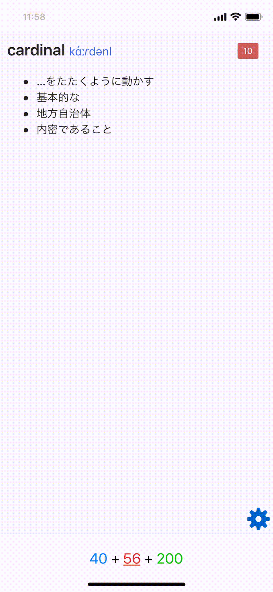
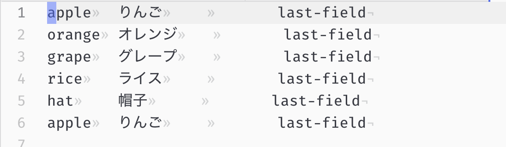
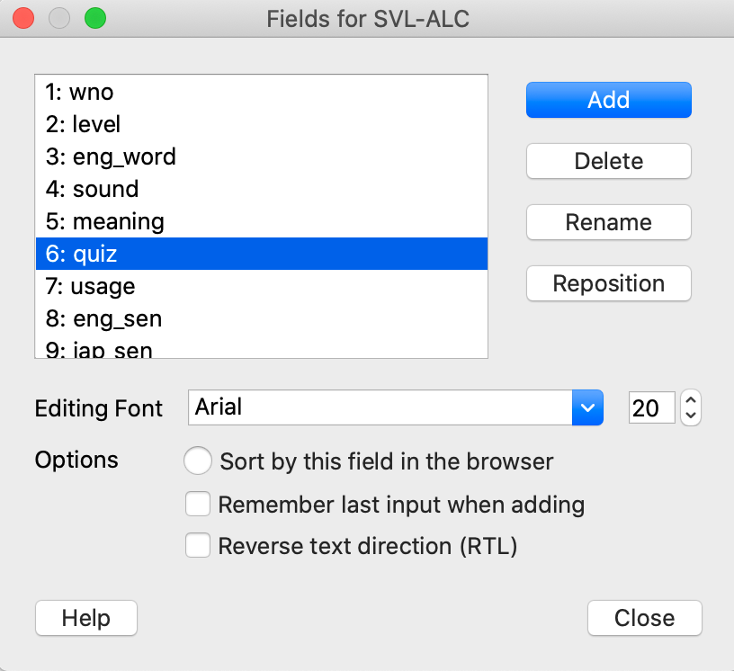
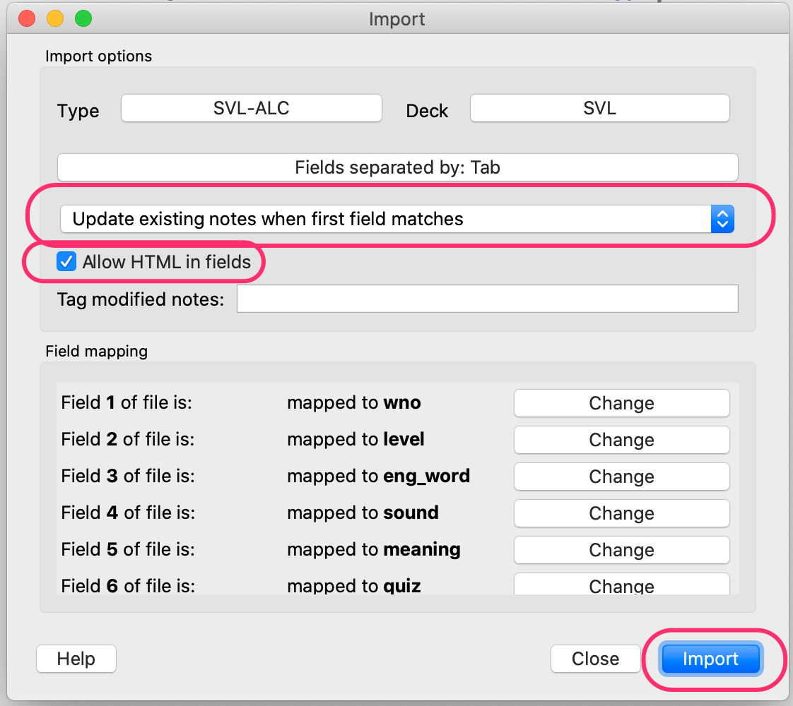
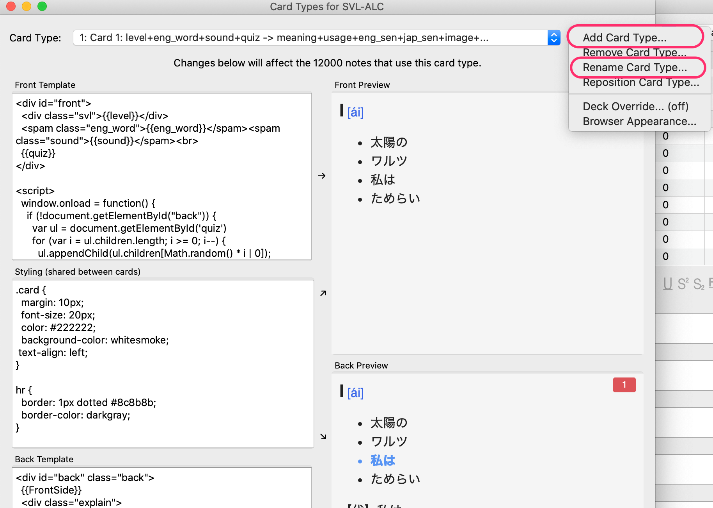

<!-- TOC START min:1 max:3 link:true asterisk:true update:true -->
* [こういうのをつくりたい](#こういうのをつくりたい)
* [ゴールまでの流れ](#ゴールまでの流れ)
* [0. ウォーミングアップ: スクリプトが何をやるのかを理解しよう](#0-ウォーミングアップ-スクリプトが何をやるのかを理解しよう)
* [1. 既存ノートにクイズ用フィールドを追加する](#1-既存ノートにクイズ用フィールドを追加する)
* [2. テキストファイル形式(txt) でエクスポートする(txt-1)](#2-テキストファイル形式txt-でエクスポートするtxt-1)
* [3. スクリプトで txt-1 にクイズを追加し、新しい txt-2 を作る](#3-スクリプトで-txt-1-にクイズを追加し新しい-txt-2-を作る)
* [4. 新しくできたファイル(txt-2)を Anki にインポートする。](#4-新しくできたファイルtxt-2を-anki-にインポートする)
* [5. 新しいカードタイプを作って、クイズ用のコード、CSSを追加](#5-新しいカードタイプを作ってクイズ用のコードcssを追加)
  * [Front](#front)
  * [Style](#style)
  * [Back](#back)
* [想定される課題](#想定される課題)
    * [答えになるフィールドのテキスト処理に関する課題](#答えになるフィールドのテキスト処理に関する課題)
    * [選択肢が毎回同じなのですが。。](#選択肢が毎回同じなのですが)
    * [カードタイプ？ノート？どうやってこなしていく？](#カードタイプノートどうやってこなしていく)
<!-- TOC END -->

# こういうのをつくりたい



# ゴールまでの流れ

0. ウォーミングアップ: スクリプトが何をやるのかを理解しよう
1. 既存ノートにクイズ用フィールドを追加する
2. テキストファイル形式(txt) でエクスポートする(txt-1)
3. スクリプトで(txt-1)にクイズを追加し、新しい(txt-2)を作る
4. 新しくできたファイル(txt-2)を Anki にインポートする。
5. 新しいカードタイプを作って、クイズ用のコード、CSSを追加

# 0. ウォーミングアップ: スクリプトが何をやるのかを理解しよう

サンプルファイルを用意したので、触りながら理解しよう。

- [sample-notes.txt](https://github.com/t9md/awesome-tadoku/blob/master/scripts/add-quiz/sample-notes.txt) は Anki からエクスポートしたNotesのテキストファイルのイメージ
- `りんご` の横の空のフィールドに、クイズを挿入するのがミッションだ。

<p></p>

`add-quiz.rb` にファイル名を与えて実行すると、１行目のレコードについて、フィールドのレポートが出る。

```
$ ruby add-quiz.rb sample-notes.txt
 0: "apple"
 1: "りんご"
 2: ""
 3: "last-field"

- Pick answer index, then pass it as -a options. e.g. -a 0
- Pick quiz index(which should be empty field), then pass it as -q options. e.g. -q 2

example: Check with a very first line
  $ ruby add-quiz.rb -a 0 -q 2 -c FILE

example: Process all records
  $ ruby add-quiz.rb -a 0 -q 2 FILE > FILE-new

$
```

- `Pick answer index`, `Pick quiz index` とある。答えになるフィールドを `-a 数字`で指定し、クイズを挿入するフィールドを `-q 数字`で指定する。
- `りんご` は 1番フィールドなので `-a 1`、クイズを挿入する空フィールドは4番なので `-q 2`。これに `-c`(チェックオプション)をつけて実行する。

```
$ ruby add-quiz.rb sample-notes.txt -a 1 -q 2 -c
{:answer=>1, :quiz=>2, :number_of_choice=>4, :check=>true}
 0: "apple"
 1: "りんご"
 2: "<ul id=\"quiz\"><li>帽子</li><li>グレープ</li><li>オレンジ</li><li id=\"quiz-answer\">りんご</li></ul>"
 3: "last-field"
$
```

フィールド2にクイズがセットされた。デフォルトで選択肢は 4つだ。この選択肢は他の行の同じフィールドの値を集めてランダムに選ばれている。`-n 3`として選択肢を３つにしたりもできる。

最後に、`-c` オプションを消して、全レコードを処理してみよう。

```
$ ruby add-quiz.rb sample-notes.txt -a 1 -q 2
apple	りんご	<ul id="quiz"><li>帽子</li><li id="quiz-answer">りんご</li><li>ライス</li><li>グレープ</li></ul>	last-field
orange	オレンジ	<ul id="quiz"><li>ライス</li><li>りんご</li><li>帽子</li><li id="quiz-answer">オレンジ</li></ul>	last-field
grape	グレープ	<ul id="quiz"><li id="quiz-answer">グレープ</li><li>りんご</li><li>オレンジ</li><li>帽子</li></ul>	last-field
rice	ライス	<ul id="quiz"><li id="quiz-answer">ライス</li><li>グレープ</li><li>りんご</li><li>オレンジ</li></ul>	last-field
hat	帽子	<ul id="quiz"><li>グレープ</li><li id="quiz-answer">帽子</li><li>オレンジ</li><li>りんご</li></ul>	last-field
$
```

うまくいっているようだ。これをファイルに書き出そう。

```
$ ruby  add-quiz.rb sample-notes.txt -a 2 -q 4 > sample-notes-new.txt
```

この sample-notes-new.txt を Anki にインポートするイメージだ。  
これでウォーミングアップは終了！Good Job!！

# 1. 既存ノートにクイズ用フィールドを追加する

ここからは実践編だ。
まず、Ankiのブラウザからクイズを追加したいデッキを選び、カードにクイズを設定する空のフィールドを追加しよう。  
↓ では `quiz` というフィールドを追加している。

<p></p>

# 2. テキストファイル形式(txt) でエクスポートする(txt-1)

デッキまるごとエクスポートしよう。形式は `Notes in Plain Text(*.txt)` を選ぶ。

<p></p>

# 3. スクリプトで txt-1 にクイズを追加し、新しい txt-2 を作る

`add-quiz.rb` スクリプトにエクスポートしたファイルを渡して実行しよう。

```
$ ruby add-quiz.rb SVL__g4.txt
 0: "9001"
 1: "10"
 2: "tactic"
 3: "[tǽktik]"
 4: "【名】戦術、戦法、作戦<br>"
 5: ""
 6: ""
 7: "The teacher tried another <b>tactic</b> to get the students interested."
 8: "その教師は、生徒の興味をひこうとして、別のやり方を試してみた。"
 9: "\"\""
10: ""

- Pick answer index, then pass it as -a options. e.g. -a 1
- Pick quiz index(which should be empty field), then pass it as -q options. e.g. -q 2

example: Check with a very first line
  $ ruby add-quiz.rb -a 1 -q 2 -c FILE

example: Process all records
  $ ruby add-quiz.rb -a 1 -q 2 FILE > FILE-new

$
```

フィールド4(`【名】戦術、戦法、作戦<br>`)を元にクイズを生成し、フィールド5に quiz を追加したいのでオプションは、`-a 4 -q 5` になる。
これにチェックする為の、`-c` オプションを加え、うまくいくかチェックしてみよう。

```
$ ruby add-quiz.rb SVL__g4.txt -a4 -q5 -c
{:answer=>4, :quiz=>5, :number_of_choice=>4, :check=>true}
 0: "9001"
 1: "10"
 2: "tactic"
 3: "[tǽktik]"
 4: "【名】戦術、戦法、作戦<br>"
 5: "<ul id=\"quiz\"><li>【名】芝</li><li>【形】切り立った</li><li id=\"quiz-answer\">【名】戦術</li><li>【形】（危険などが）差し迫った</li></ul>"
 6: ""
 7: "The teacher tried another <b>tactic</b> to get the students interested."
 8: "その教師は、生徒の興味をひこうとして、別のやり方を試してみた。"
 9: "\"\""
10: ""
$
```

↑  フィールド5に注目。クイズの HTMLフィールドが追加されたことが分かる。うまくいってそうなので、全部処理してファイルに書き出そう。

```
$ ruby add-quiz.rb SVL__g4.txt -a4 -q5 > SVL__g4-new.txt
```

# 4. 新しくできたファイル(txt-2)を Anki にインポートする。

<p></p>

新しくできたファイルを Anki にインポートする。
下記のインポート画面のポイントのみ記載する。
- 今回はノート(レコード)の追加は一切なく、既存ノートの修正なので、"Update existing notes when first field matches"(最初のフィールドがマッチしたら既存ノートを更新)を選ぶ
- Allow HTML in fields(フィールド内でHTMLを使用することを許可)をチェック

# 5. 新しいカードタイプを作って、クイズ用のコード、CSSを追加

デッキのカードの編集画面で、カードタイプを追加しよう。"Rename Card Type..."で、新しく追加したカードタイプに、分かりやすい名前をつけよう(quiz とかが良いかも).  
追加したカードタイプのテンプレートを編集して、クイズが表示されるようにしよう。



## Front

```html
{{word}}
<hr>
{{quiz}}

<script>
  // これは表面が表示された時にクイズの選択肢をシャッフルするためのコード。
  // 答えを位置で覚えてしまうのを防ぐ為.
  function isBack() {
    var frontElement = document.getElementById('front')
    return frontElement.parentElement.id === 'back'
  }

  function shuffleChildren(node, order) {
    var newOrder = []
    var wasBack = isBack()

    for (var i = node.children.length; i >= 0; i--) {
      if (wasBack) {
        n = window.quizShuffleOrder.shift()
      } else {
        n = Math.random() * i | 0
      }
      node.appendChild(node.children[n]);
      newOrder.push(n);
    }
    window.quizShuffleOrder = newOrder;
    if (wasBack) {
      window.quizShuffleOrder = undefined;
    }
  }

  shuffleChildren(document.getElementById('quiz'))

</script>
```

- [参考]: `{{quiz}}`の部分には以下のようなHTMLが入る。

```html
<ul id="quiz">
  <li>【名】選挙民</li>
  <li id="quiz-answer">【名】戦術</li>
  <li>【形】大陸横断の</li>
  <li>【形】少しずつの</li>
</ul>"
```

## Style

```css
hr {
  border: 1px dotted #8c8b8b;
  border-color: darkgray;
}
#quiz { font-size: 0.8em; }

/* 背面の "back" コンテナ内の正解(id=quiz-answer)を太字にし、青字にする。 */
#back #quiz-answer {
  font-weight: bold;
  color: cornflowerblue;
}
```

## Back

```html
<div id="back">
  {{FrontSide}}
</div>
```

# 想定される課題

各自が実行した時に直面するであろう課題について、ここでフォローしておく。

### 答えになるフィールドのテキスト処理に関する課題

"答えになるフィールドが長すぎるので短くしたい"とか"【】"で囲まれた【形】とか【副】とかが同じフィールドに含まれていて、それがヒントになってしまうので、消したい"とか色々ありそうだ。

`-a N`で指定したフィールドを下処理するコードは以下の部分。必要なら以下のメソッドのコードを直接変更して見て欲しい。

```ruby
def extract_meaning(s)
  # s.match(/【(.)】(.+?)(?:[、。]|(:?<br>)|$)/)
  s.match(/(.+?)(?:[、。]|(:?<br>)|$)/)
  $1
end
```

### 選択肢が毎回同じなのですが。。

ノートに静的にクイズが埋め込まれているのでこれは仕方ない。
必要なら再度エクスポートして、スクリプトにかけてクイズを再度追加した後読み込むしかない。

### カードタイプ？ノート？どうやってこなしていく？

- ノートというのは登録したレコード(単語のスペル、意味、例文等のまとまりのあるセット。)
- カードは実際にAnkiで easy とか again でこなすアイテム
- カードはカードタイプから生成される。
- カードタイプで 表面、裏面、スタイルを指定する。
- 一つのノートに複数のカードタイプを紐付ける事が可能で、例えばCardType-1は"英→日"で、CardType-2は"日→英"にするとか。
- カードタイプの追加はインパクトの大きい作業だ。例えばSVL12000を登録すると、12000単語分のノートが存在することになるが、"カードタイプの数 x ノート数"がこなすべきカードの総量になる。
- SVL12000にの12000のノートに、CardType-1(英→日)、CardType-2(クイズ)のように２つのカードタイプを作ると、24000のカードが生成される。この時想定される要望は次のものだ。
- CardType-1と、CardType-2が混ざって出てくるのが嫌だ。分けて学習したい。これをどうやってやるか？
  - 案1: filter を作る。`card:1` や `card:2` のようにカードタイプの番号を指定してフィルタを作り、そのフィルタで学習する
  - 案2: クイズを一通りやるぞーと決めてクイズモードのカード以外のカードを埋める(bury)たとえば、 `card:1` をブラウザで検索した後、全選択し、一括で `bury` する。クイズである程度覚えたら、`card:1` を un-`bury`して、`card:2` を `bury` する。
