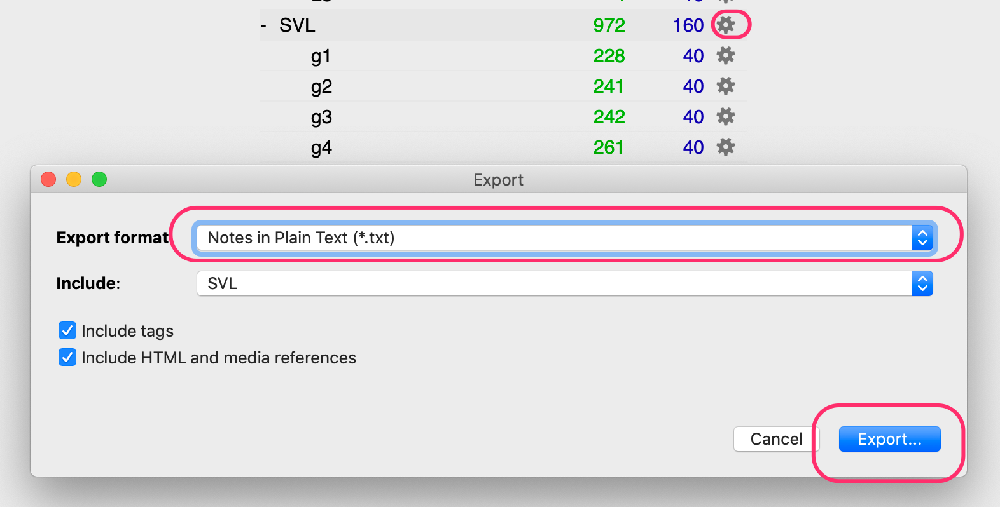

<!-- TOC START min:1 max:3 link:true asterisk:true update:true -->
* [こういうのをつくりたい](#こういうのをつくりたい)
* [ゴールまでの流れ](#ゴールまでの流れ)
* [0. ウォーミングアップ: スクリプトが何をやるのかを理解しよう](#0-ウォーミングアップ-スクリプトが何をやるのかを理解しよう)
* [1. 既存ノートにクイズ用フィールドを追加する](#1-既存ノートにクイズ用フィールドを追加する)
* [2. テキストファイル形式(txt) でエクスポートする(txt-1)](#2-テキストファイル形式txt-でエクスポートするtxt-1)
* [3. スクリプトで txt-1 にクイズを追加し、新しい txt-2 を作る](#3-スクリプトで-txt-1-にクイズを追加し新しい-txt-2-を作る)
* [4. 新しくできたファイル(txt-2)を Anki にインポートする。](#4-新しくできたファイルtxt-2を-anki-にインポートする)
* [5. 新しいカードタイプを作って、クイズ用のコード、CSSを追加](#5-新しいカードタイプを作ってクイズ用のコードcssを追加)
  * [Front](#front)
  * [Style](#style)
  * [Back](#back)
* [想定される課題](#想定される課題)
    * [答えになるフィールドのテキスト処理に関する課題](#答えになるフィールドのテキスト処理に関する課題)
    * [選択肢が毎回おなじなんだけど？](#選択肢が毎回おなじなんだけど)
    * [カードタイプ？ノート？どうやってこなしていく？](#カードタイプノートどうやってこなしていく)
<!-- TOC END -->

# こういうのをつくりたい


# ゴールまでの流れ

0. ウォーミングアップ: スクリプトが何をやるのかを理解しよう
1. 既存ノートにクイズ用フィールドを追加する
2. テキストファイル形式(txt) でエクスポートする(txt-1)
3. スクリプトで(txt-1)にクイズを追加し、新しい(txt-2)を作る
4. 新しくできたファイル(txt-2)を Anki にインポートする。
5. 新しいカードタイプを作って、クイズ用のコード、CSSを追加

# 0. ウォーミングアップ: スクリプトが何をやるのかを理解しよう

サンプルファイルを用意したので、触りながら理解しよう。

- [sample-notes.txt](https://github.com/t9md/awesome-tadoku/blob/master/scripts/add-quiz/sample-notes.txt) は Anki からエクスポートしたNotesのテキストファイルのイメージ
- `りんご` の横の空のフィールドに、クイズを挿入するのがミッションだ。

<p></p>

`add-quiz.rb` にファイル名を与えて実行すると、１行目のレコードについて、フィールドのレポートが出る。

```sh
$ ruby  add-quiz.rb sample-notes.txt
 0: "apple"
 1: "\t"
 2: "りんご"
 3: "\t"
 4: ""
 5: "\t"
 6: "last-field"

- Pick answer index, then pass it as -a options. e.g. -a 8
- Pick quiz index(which should be empty field), then pass it as -q options. e.g. -q 10

example: Check with a very first line
  $ ruby add-quiz.rb -a 8 -q 10 -c FILE

example: Process all records
  $ ruby add-quiz.rb -a 8 -q 10 FILE > FILE-new
```

- `Pick answer index`, `Pick quiz index` とある。答えになるフィールドを `-a 数字`で指定し、クイズを挿入するフィールドを `-q 数字`で指定する。
- `りんご` は 2フィールドなので `-a 2`、クイズを挿入する空フィールドは 4なので `-q 4`。これに `-c`(チェックオプション)をつけて実行する。

```sh
$ scripts/add-quiz% ruby  add-quiz.rb  -a 2 -q 4 -c sample-notes.txt
{:answer=>2, :quiz=>4, :number_of_choice=>4, :check=>true}
 0: "apple"
 1: "\t"
 2: "りんご"
 3: "\t"
 4: "<ul id=\"quiz\"><li>グレープ</li><li>オレンジ</li><li>ライス</li><li id=\"quiz-answer\">りんご</li></ul>"
 5: "\t"
 6: "last-field"
```

フィールド4にクイズが挿入された。デフォルトで選択肢は 4つだ。この選択肢は他の行の同じフィールドの値を集めてランダムに選ばれている。`-n 3`として選択肢を３つにしたりもできる。

最後に、`-c` オプションを消して、全レコードを処理してみよう。

```
$ ruby  add-quiz.rb sample-notes.txt -a 2 -q 4
apple   りんご  <ul id="quiz"><li id="quiz-answer">りんご</li><li>オレンジ</li><li>ライス</li><li>グレープ</li></ul>    last-field
orange  オレンジ        <ul id="quiz"><li id="quiz-answer">オレンジ</li><li>グレープ</li><li>ライス</li><li>りんご</li></ul>    last-field
grape   グレープ        <ul id="quiz"><li>帽子</li><li id="quiz-answer">グレープ</li><li>オレンジ</li><li>りんご</li></ul>      last-field
rice    ライス  <ul id="quiz"><li>オレンジ</li><li>りんご</li><li id="quiz-answer">ライス</li><li>グレープ</li></ul>    last-field
hat     帽子    <ul id="quiz"><li>りんご</li><li>オレンジ</li><li id="quiz-answer">帽子</li><li>ライス</li></ul>        last-field
apple   りんご  <ul id="quiz"><li>オレンジ</li><li>帽子</li><li>ライス</li><li id="quiz-answer">りんご</li></ul>        last-field
master scripts/add-quiz%
```

うまくいっている。これを新ファイルに書き出そう。

```
$ ruby  add-quiz.rb sample-notes.txt -a 2 -q 4 > new-sample-notes.txt
```

以上でウォーミングアップは終了だ！ Good Job!

# 1. 既存ノートにクイズ用フィールドを追加する

ここから実践辺だ。

<p></p>

# 2. テキストファイル形式(txt) でエクスポートする(txt-1)


<p></p>

# 3. スクリプトで txt-1 にクイズを追加し、新しい txt-2 を作る


```sh
$ scripts/add-quiz% ruby add-quiz.rb SVL__g4.txt
 0: "9001"
 1: "\t"
 2: "10"
 3: "\t"
 4: "tactic"
 5: "\t"
 6: "[tǽktik]"
 7: "\t"
 8: "【名】戦術、戦法、作戦<br>"
 9: "\t"
10: ""
11: "\t"
12: ""
13: "\t"
14: "The teacher tried another <b>tactic</b> to get the students interested."
15: "\t"
16: "その教師は、生徒の興味をひこうとして、別のやり方を試してみた。"
17: "\t"
18: "\"\""
19: "\t"

- Pick answer index, then pass it as -a options. e.g. -a 8
- Pick quiz index(which should be empty field), then pass it as -q options. e.g. -q 10

example: Check with a very first line
  $ ruby add-quiz.rb -a 8 -q 10 -c FILE

example: Process all records
  $ ruby add-quiz.rb -a 8 -q 10 FILE > FILE-new

```

フィールド8(`【名】戦術、戦法、作戦<br>`)を元にクイズを生成し、フィールド10に quiz を追加したいのでオプションは、`-a 8 -q 10` になる。
これにチェックする為の、`-c` オプションを加え、うまくいくかチェックしてみよう。

```
$ ruby add-quiz.rb -a 8 -q 10 -c SVL__g4.txt
{:answer=>8, :quiz=>10, :number_of_choice=>4, :check=>true}
 0: "9001"
 1: "\t"
 2: "10"
 3: "\t"
 4: "tactic"
 5: "\t"
 6: "[tǽktik]"
 7: "\t"
 8: "【名】戦術、戦法、作戦<br>"
 9: "\t"
10: "<ul id=\"quiz\"><li>【名】選挙民</li><li id=\"quiz-answer\">【名】戦術</li><li>【形】大陸横断の</li><li>【形】少しずつの</li></ul>"
11: "\t"
12: ""
13: "\t"
14: "The teacher tried another <b>tactic</b> to get the students interested."
15: "\t"
16: "その教師は、生徒の興味をひこうとして、別のやり方を試してみた。"
17: "\t"
18: "\"\""
19: "\t"
$
```

↑  フィールド10に注目。クイズの HTMLフィールドが追加されたことが分かる。うまくいってそうなので、全部処理してファイルに書き出そう。

```
$ ruby add-quiz.rb SVL__g4.txt -a 8 -q 10 > SVL__g4-new.txt
```

# 4. 新しくできたファイル(txt-2)を Anki にインポートする。

<p></p>

新しくできたファイルを Anki にインポートする。
下記のインポート画面のポイントのみ記載する。
- 今回はノート(レコード)の追加は一切なく、既存ノートの修正なので、"Update existing notes when first field matches"(最初のフィールドがマッチしたら既存ノートを更新)を選ぶ
- Allow HTML in fields(フィールド内でHTMLを使用することを許可)をチェック

# 5. 新しいカードタイプを作って、クイズ用のコード、CSSを追加

デッキのカードの編集画面で、カードタイプを追加しよう。"Rename Card Type..."で、新しく追加したカードタイプの名前をわかりやすい名前をつけよう(quiz とかが良いかもね！).
追加したカードタイプのテンプレートを編集しよう。


## Front

```html
<div id="front">
  {{word}}
  <hr>
  {{quiz}}
</div>

<script>
  // これは表面が表示された時にクイズの選択肢をシャッフルするためのコード。
  // 答えを位置で覚えてしまうのを防ぐ為.
  window.onload = function() {
    if (!document.getElementById("back")) {
      var ul = document.getElementById('quiz')
      for (var i = ul.children.length; i >= 0; i--) {
        ul.appendChild(ul.children[Math.random() * i | 0]);
      }
    }
  }
</script>
```

- [参考]: `{{quiz}}`の部分には以下のようなHTMLが入る。

```html
<ul id="quiz">
  <li>【名】選挙民</li>
  <li id="quiz-answer">【名】戦術</li>
  <li>【形】大陸横断の</li>
  <li>【形】少しずつの</li>
</ul>"
```

## Style

```css
hr {
  border: 1px dotted #8c8b8b;
  border-color: darkgray;
}

#quiz {
  font-size: 0.8em;
}

/* 背面の "back" コンテナ内の正解(id=quiz-answer)を太字にし、青字にする。 */
#back #quiz-answer {
  font-weight: bold;
  color: cornflowerblue;
}

```

## Back

```html
<div id="back" class="back">
  {{FrontSide}}
</div>
```

# 想定される課題

各自が実行した時に直面するであろう課題について、ここでフォローしておく。

### 答えになるフィールドのテキスト処理に関する課題

"答えになるフィールドが長すぎるので短くしたい"とか"【】"で囲まれた【形】とか【副】とかが同じフィールドに含まれていて、それがヒントになってしまうので、消したい"とか色々ありそうだ。

`-a N`で指定したフィールドを下処理するコードは以下の部分。必要なら以下のメソッドのコードを直接変更して見て欲しい。

```ruby
def extract_meaning(s)
  # s.match(/【(.)】(.+?)(?:[、。]|(:?<br>)|$)/)
  s.match(/(.+?)(?:[、。]|(:?<br>)|$)/)
  $1
end
```

### 選択肢が毎回おなじなんだけど？

ノートに静的にクイズが埋め込まれているのでこれは仕方ない。
必要なら再度エクスポートして、スクリプトにかけてクイズを再度追加した後読み込むしかない。

### カードタイプ？ノート？どうやってこなしていく？

- ノートというのは登録したレコード(単語のスペル、意味、例文等のまとまりのあるセット。)
- カードは実際にAnkiで easy とか again でこなすアイテム
- カードはカードタイプから生成される。
- カードタイプで 表面、裏面、スタイルを指定する。
- 一つのノートに複数のカードタイプを紐付ける事が可能で、例えばCardType-1は"英→日"で、CardType-2は"日→英"にするとか。
- カードタイプの追加はインパクトの大きい作業だ。例えばSVL12000を登録すると、12000単語分のノートが存在することになるが、"カードタイプの数 x ノート数"がこなすべきカードの総量になる。
- SVL12000にの12000のノートに、CardType-1(英→日)、CardType-2(クイズ)のように２つのカードタイプを作ると、24000のカードが生成される。この時想定される要望は次のものだ。
- CardType-1と、CardType-2が混ざって出てくるのが嫌だ。分けて学習したい。これをどうやってやるか？
  - 案1: filter を作る。`card:1` や `card:2` のようにカードタイプの番号を指定してフィルタを作り、そのフィルタで学習する
  - 案2: クイズを一通りやるぞーと決めてクイズモードのカード以外のカードを埋める(bury)たとえば、 `card:1` をブラウザで検索した後、全選択し、一括で `bury` する。クイズである程度覚えたら、`card:1` を un-`bury`して、`card:2` を `bury` する。
